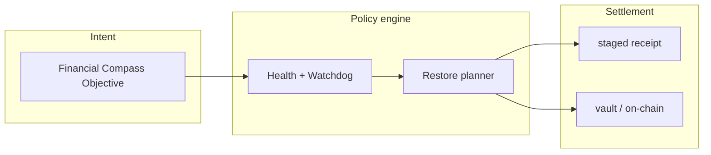
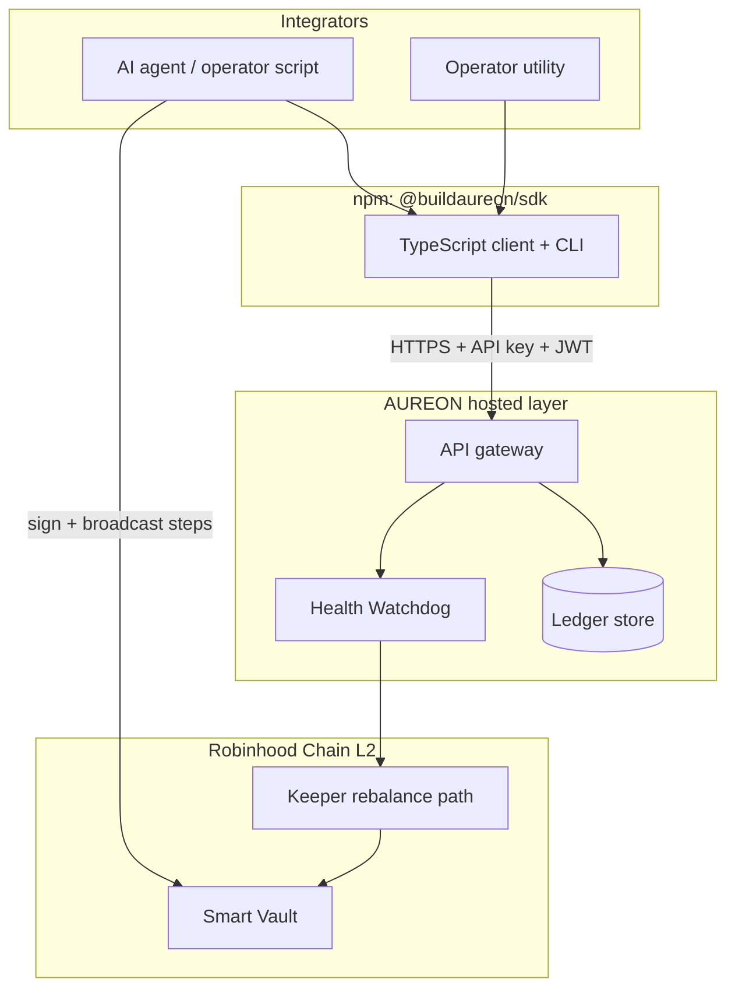
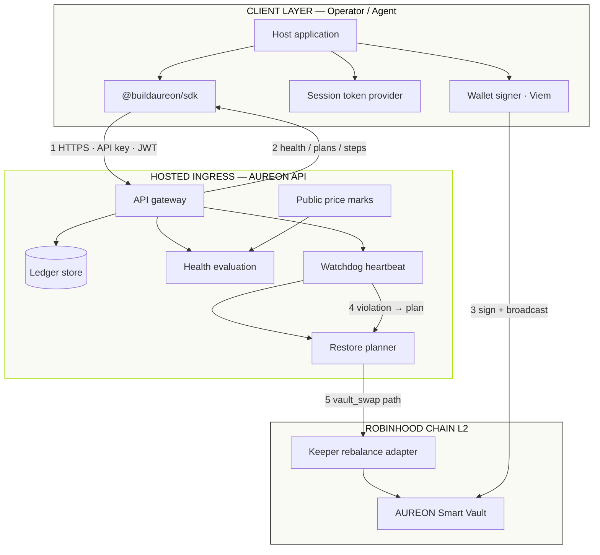
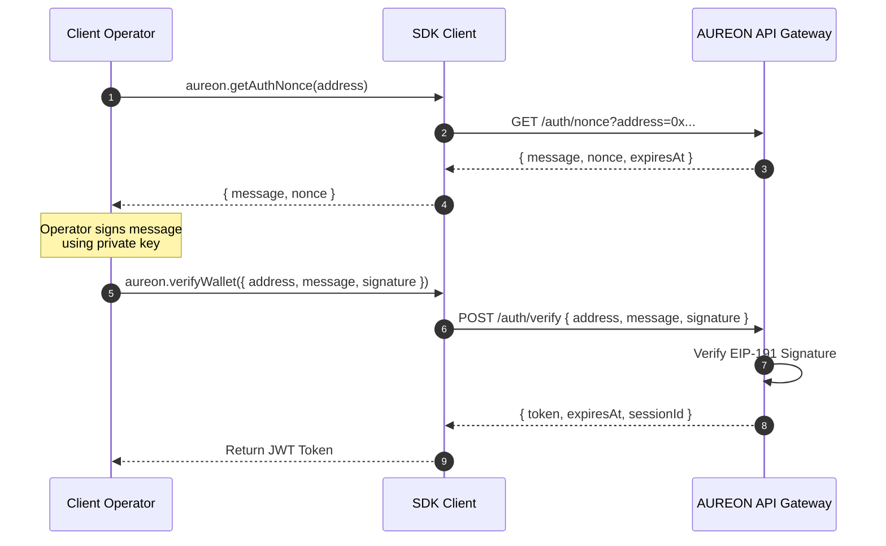
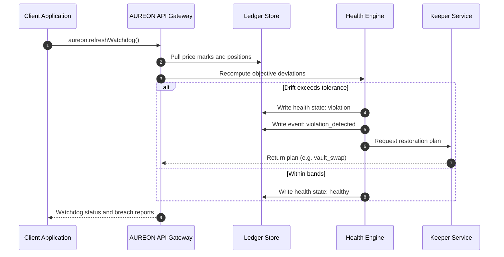

<div align="center">

# Aureon

**Financial Intelligence Layer for Onchain AI Agents**

The official TypeScript HTTP client for the AUREON API.
Financial Compass, capital health, and verified restore plans: one typed integration surface.

**Contract Address (CA):** `0xd293291060334d42e5dbea6fb854c231af527777`

[](https://www.typescriptlang.org/)
[](#requirements)
[](https://github.com/buildaureon)
[](LICENSE)
[](#requirements)

<br />

```bash
pnpm add @buildaureon/sdk
```

[Quickstart](#quickstart) · [Authentication](#authentication) · [API Surface](#api-surface) · [Docs](#documentation)

</div>

---

## Table of contents

1. [Overview](#overview)
2. [What is AUREON?](#what-is-aureon)
3. [What this SDK is](#what-this-sdk-is)
4. [Ecosystem](#ecosystem)
5. [Full system architecture](#full-system-architecture)
6. [End-to-end flows](#end-to-end-flows)
7. [Requirements & installation](#requirements--installation)
8. [Quick start](#quick-start)
9. [Authentication](#detailed-authentication-guide)
10. [API surface reference](#api-surface-reference--code-walkthroughs)
11. [Client configuration](#client-configuration--transport-engine)
12. [Error model](#error-model-and-code-handling)
13. [CLI](#cli-command-line-guide)
14. [Design principles](#design-principles--settlement-honesty)
15. [Documentation registry](#documentation-registry)
16. [Community](#community--resources)

---

## Overview

**AUREON** is the financial intelligence layer for onchain AI agents on **Robinhood Chain**. Agents and operators do not live on one-off swaps. They need continuous policy: keep a stable sleeve near a target weight, hold exposure bands on equity tokens, and restore capital when markets move. AUREON turns those rules into first-class **Financial Compass Objectives** — registered policies the system monitors, scores for health, and restores with explicit settlement receipts.

Traditional web3 tooling is transactional. An operator submits a deposit or a swap, the chain settles once, and the broader intent disappears. Markets then move. Allocations drift. The agent either wakes up late or fires uncontrolled rebalances with no shared memory of why capital was supposed to look a certain way. AUREON closes that gap with a hosted policy and health engine, a non-custodial vault path on Robinhood Chain, and a typed TypeScript client so integrators never hand-roll the trust boundary between monitoring and signing.

**`@buildaureon/sdk`** is the official TypeScript HTTP client in this repository. It is how agent runtimes, operator scripts, and product surfaces talk to the AUREON API: wallet session handshake, Capital Book sync, objective CRUD, health and timeline queries, vault deposit and withdraw step preparation, restore plan execution, and controlled market-event rehearsal for integration tests. Private keys stay with the host application. The API never holds custody. Receipts are honest about whether settlement was **vault** (on-chain) or **staged** (ledger-local, labeled for UI transparency).

The broader product stack includes the hosted AUREON API and Health Watchdog, the operator utility at [app.aureonlabs.network](https://app.aureonlabs.network), Smart Vault contracts on Robinhood Chain, and the public site at [aureonlabs.network](https://www.aureonlabs.network/). This README is the integrator front door — dense enough to understand the system, practical enough to ship a first session, and linked into the long-form docs under `docs/`.

---

## What is AUREON?

AUREON treats capital as a living policy surface rather than a sequence of forgotten transactions. Developers register continuous financial rules — for example, “maintain a stablecoin buffer at 25% of total portfolio value with a three-point tolerance.” The system then:

- Monitors holdings across active addresses and smart vault contracts.
- Marks portfolio value with public market data.
- Detects allocation breaches against registered objective bands.
- Produces recovery instructions (wrap or unwrap paths, keeper-driven vault swaps).
- Appends an auditable timeline of compliance events and restore receipts.

### The concept: persistent objectives, honest settlement

Unlike a one-shot rebalancer bot that fires and forgets, AUREON keeps the objective as the primitive. Health state, timeline events, and restore plans all hang off that policy object. When drift exceeds tolerance, the watchdog records a violation, a restore plan is available, and execution returns a receipt whose `settlement` field tells the truth about where capital actually moved.



### What AUREON is not

- Not a custodian. Private keys never leave the client.
- Not a silent black-box trader. Restores are plan-driven and receipted.
- Not a claim that every restore is on-chain. `settlement: "staged"` means ledger-local and must be labeled as such in product UI.

---

## What this SDK is

**`@buildaureon/sdk`** is the npm-facing TypeScript package for application developers and agent authors.

| You can | Through |
| --- | --- |
| Authenticate with an issued API key (wallet identity) | `apiKey` on `createAureonClient` |
| Authenticate a wallet session (optional nonce → sign) | `getAuthNonce`, `verifyWallet`, `createSessionTokenProvider` |
| Sync and manage the Capital Book | `syncPortfolio`, `setPortfolio`, `clearPortfolio` |
| Create and query Financial Compass objectives | `createObjective`, `listObjectives`, `getObjective` |
| Read health, timeline, and overview | `getHealth`, `getTimeline`, `getOverview`, `refreshWatchdog` |
| Prepare non-custodial vault deposit / withdraw steps | `prepareVaultDeposit`, related vault helpers |
| Fetch and execute restore plans | `getRestorePlan`, `restoreObjective` |
| Apply controlled market events for integration rehearsal | `applyMarketEvent` |
| Manage developer API keys | `createApiKey`, `listApiKeys`, `toggleApiKey`, `revokeApiKey` |

**This package alone does not:**

- Hold or rotate private keys.
- Broadcast transactions (your viem / wallet client does).
- Deploy Smart Vault contracts.
- Replace the hosted Health Watchdog — it calls it.

---

## Ecosystem



| Component | Surface | Role |
| --- | --- | --- |
| **@buildaureon/sdk** (this repo) | TypeScript / CLI | Typed client, session helpers, vault step prep |
| **AUREON API** | Hosted HTTPS | Objectives, health, timeline, restore coordination |
| **Operator utility** | [app.aureonlabs.network](https://app.aureonlabs.network) | Human console for keys, capital, and policy |
| **Smart Vaults** | Robinhood Chain | Non-custodial on-chain capital path |
| **Website** | [aureonlabs.network](https://www.aureonlabs.network/) | Product narrative and entry points |

---

## Full system architecture

Complete AUREON topology: SDK client, hosted policy engines, ledger, vault settlement, and local signing.



### Architecture at a glance

| Layer | Components | Trust boundary |
| --- | --- | --- |
| **Client** | Host app, `@buildaureon/sdk`, session provider, local signer | Keys and broadcast stay here |
| **Hosted** | API, ledger, oracles, health, watchdog, planner | Policy, pricing, coordination — no private keys |
| **Chain** | Smart Vault, keeper path | Settlement when `settlement: "vault"` |

Deep dive: [docs/architecture.md](docs/architecture.md) · [docs/security.md](docs/security.md) · [docs/integration-guide.md](docs/integration-guide.md)

---

## End-to-end flows

### Client–API trust boundary

To protect user funds, AUREON splits responsibility. The hosted API monitors capital, marks prices, evaluates objectives, and coordinates restore plans. The host application alone stores keys and signs transactions. The SDK sits on that boundary: it validates inputs, transports requests, prepares unsigned vault calldata, and never asks for a private key.

| Layer | Responsibility |
| --- | --- |
| **SDK** | Transport, validation, retries, EIP-712 helpers, vault step construction |
| **AUREON API** | Ledger sync, objective logic, price marks, timeline, staged or vault restore coordination |
| **Host application** | Key storage, wallet UX, signing, broadcasting |

### Session authentication flow

Authentication is a challenge–response handshake that binds a wallet address to a temporary JWT.



### Watchdog and restore flow

When portfolio weights drift past tolerance, health flips to violation and a restore plan becomes available.



Typical operator loop in prose:

1. **Define capital** — sync the Capital Book from chain or seed an explicit book for rehearsal.
2. **Register policy** — create a Financial Compass objective with target weight and tolerance.
3. **Observe** — poll health and timeline; refresh the watchdog after market moves.
4. **Restore** — fetch the plan, execute restore, read `settlement` on the receipt.
5. **Verify** — confirm health returns to healthy and the timeline shows the restore event.

---

## Requirements & installation

### Requirements

- **Node.js** 20 or higher (ESM).
- **Viem** 2.x when you sign and broadcast vault steps.

### Installation

```bash
pnpm add @buildaureon/sdk
# or
npm install @buildaureon/sdk
# or
yarn add @buildaureon/sdk
```

---

## Quick start

Initialize the client with an **issued** developer API key (Developers page in the utility).
That key identifies your wallet for control-plane calls — sync, objectives, health, restore plans.
A private key is only needed later to **broadcast** on-chain deposit/withdraw txs.

**SDK supports Automatic objectives only** (`automationMode: "auto"`, the default). Manual Approve workflows stay in the operator utility.

```ts
import { createAureonClient } from "@buildaureon/sdk";

async function run() {
  const aureon = createAureonClient({
    baseUrl: "https://api.aureonlabs.network",
    apiKey: process.env.AUREON_API_KEY!, // issued key from Developers console
  });

  const me = await aureon.me();
  console.log("wallet", me.walletAddress);

  const synced = await aureon.syncPortfolio();
  console.log("Portfolio Value USD:", synced.portfolio.totalNotionalUsd);
}
```

Optional wallet Bearer (nonce → sign → `verifyWallet`) still works and **wins** when both
are sent. Env bootstrap keys (`AUREON_API_KEYS` on the server) unlock product access only —
they do not identify a wallet; use an issued key or a Bearer session with those.

From here, create an objective, read health, and restore when the watchdog reports a violation.
Full walkthroughs live in [docs/integration-guide.md](docs/integration-guide.md).

---

## Detailed authentication guide

### Issued API keys (recommended for SDK / agents)

Create a key in the operator utility **Developers** console. The plaintext secret is shown once.
Send it as `X-Aureon-Api-Key`. The gateway resolves the bound wallet and scopes ledger operations
to that address. Treat issued keys like passwords: pause, revoke, rotate; never commit them.

### Private key / on-chain signing

`prepareVaultDeposit` / `prepareVaultWithdraw` return **unsigned** calldata. Broadcasting those
transactions (and any other signed chain steps) requires the wallet private key or a browser
wallet — not the API key.

### Wallet bearer handshake (optional)

Bearer sessions also scope ledger operations to a wallet. The SDK fetches a nonce message, the
host signs it with an EVM signer, and `/auth/verify` returns a session token for `getAccessToken`.
Use this for the browser utility, or when you only have an env bootstrap key (no issued key).

### Token provider lifecycle

```ts
import { createSessionTokenProvider } from "@buildaureon/sdk";

const session = createSessionTokenProvider(process.env.AUREON_TOKEN ?? null);

await aureon.logout();
session.clear();
```

`createSessionTokenProvider` is a small stateful container: set after verify, clear on logout,
inject via `getAccessToken` so the client stays free of global mutable auth state.

---

## API surface reference & code walkthroughs

### Connection smoke tests

```ts
const ping = await aureon.ping();
console.log(`Connected. Backend version: ${ping.version}`);
```

### Managing the Capital Book

The Capital Book is the set of positions AUREON tracks for weight and health math. Sync from Robinhood Chain and vaults, or set an explicit book for controlled rehearsal environments.

```ts
const syncResult = await aureon.syncPortfolio();
console.log("Current stable coin weight:", syncResult.portfolio.stableWeight);

const updatedBook = await aureon.setPortfolio([
  { symbol: "WETH", quantity: 2.5, category: "gas" },
  { symbol: "USDG", quantity: 2500, category: "stable" },
]);

await aureon.clearPortfolio();
```

### Defining and querying objectives

Objectives are the Financial Compass primitives: target weights, tolerance bands, and priority. SDK-created objectives participate in automatic restore coordination when health enters violation.

```ts
const stableObj = await aureon.createObjective({
  name: "Stable Core Reserve",
  kind: "stable_allocation",
  targetWeight: 0.3,
  tolerance: 0.03,
  priority: "high",
});

const stockObj = await aureon.createObjective({
  name: "Tesla Sleeve Allocation",
  kind: "balanced_portfolio",
  targetSymbol: "TSLA",
  targetWeight: 0.2,
  tolerance: 0.05,
});

const objectives = await aureon.listObjectives();
```

### Health, timeline, and overview

```ts
const healthRecords = await aureon.getHealth();
for (const health of healthRecords) {
  console.log(`Objective ${health.objectiveId}: State: ${health.state}`);
}

const timeline = await aureon.getTimeline();
timeline.forEach((event) => console.log(`[${event.type}]: ${event.message}`));

const overview = await aureon.getOverview();
console.log("Global health score:", overview.globalHealthScore);
```

### Non-custodial vault operations

Vault helpers prepare unsigned steps. The host signs and broadcasts; AUREON never receives the private key.

```ts
import type { Hex } from "viem";

const depositData = await aureon.prepareVaultDeposit({
  symbol: "ETH",
  amount: "0.5",
});

for (const step of depositData.steps) {
  const hash = await walletClient.sendTransaction({
    account,
    to: step.to as `0x${string}`,
    data: step.data as Hex,
    value: BigInt(step.value),
  });
  await publicClient.waitForTransactionReceipt({ hash });
}
```

### Restore plans and rebalances

When health is in violation, fetch the plan and execute. Always read `settlement` on the receipt.

```ts
const plan = await aureon.getRestorePlan(objective.id);
console.log(`Plan requires action: ${plan.kind} for ${plan.amountHuman} tokens.`);

if (plan.kind === "vault_swap") {
  const receipt = await aureon.restoreObjective(objective.id);
  console.log("Rebalance transaction hash:", receipt.transactionHash);
  console.log("Settlement environment:", receipt.settlement); // "vault" | "staged"
} else {
  console.warn("Execute wrap_eth or unwrap_weth with your wallet provider.");
}
```

### Controlled market events

Apply a deterministic price mark change to rehearse breach and restore paths in integration environments. This is a controlled market event against the ledger marks — not a claim of live exchange execution.

```ts
const shockResult = await aureon.applyMarketEvent({
  symbol: "NVDA",
  priceChangeRatio: -0.15,
  autoRestore: true,
});
```

### Developer API key management

```ts
const newKey = await aureon.createApiKey("Secondary Bot Ingress");
console.log(`Plaintext secret: ${newKey.secret}`);

const keys = await aureon.listApiKeys();
await aureon.toggleApiKey(newKey.id);
await aureon.revokeApiKey(newKey.id);
```

---

## Client configuration & transport engine

### Configuration reference

| Parameter | Type | Default | Description |
| --- | --- | --- | --- |
| `baseUrl` | `string` | `"https://api.aureonlabs.network"` | API ingress |
| `apiKey` | `string` | `undefined` | Sent as `X-Aureon-Api-Key` |
| `authToken` | `string` | `undefined` | Static JWT bearer |
| `getAccessToken` | `() => string \| null` | `undefined` | Dynamic bearer resolver |
| `timeoutMs` | `number` | `30000` | Per-call abort threshold |
| `maxRetries` | `number` | `0` | Transient failure retries |
| `retryDelayMs` | `number` | `250` | Delay between retries |
| `headers` | `Record<string, string>` | `{}` | Extra headers |
| `fetch` | `typeof fetch` | `globalThis.fetch` | Custom fetch override |

### Retries and failover

When `maxRetries` is greater than zero, the client retries timeouts and selected transient HTTP failures with a fixed `retryDelayMs`. Prefer raising retries for long-running agent loops; keep them low for interactive UI paths where fail-fast is better.

---

## Error model and code handling

### Error code reference

| Code | HTTP | Description |
| --- | --- | --- |
| `UNAUTHORIZED` | 401 | Missing or invalid API key or bearer |
| `VALIDATION_ERROR` | 400 | Payload failed validation |
| `NOT_FOUND` | 404 | Objective, key, or resource missing |
| `CONFLICT` | 409 | Request conflicts with current ledger state |
| `RATE_LIMITED` | 429 | Request volume exceeded |
| `SERVER_ERROR` | 500 / 503 | Hosted execution failure |
| `TIMEOUT` | — | Exceeded `timeoutMs` |
| `NETWORK_ERROR` | — | Endpoint unreachable |

### Narrowing errors in practice

```ts
import { isAureonError } from "@buildaureon/sdk";

try {
  await aureon.getObjective("missing_id");
} catch (error) {
  if (isAureonError(error)) {
    switch (error.code) {
      case "NOT_FOUND":
        console.error("The specified objective does not exist.");
        break;
      case "UNAUTHORIZED":
        console.error("Check API key and wallet session configuration.");
        break;
      default:
        console.error(`Aureon error: ${error.message}`);
    }
  } else {
    console.error("Generic execution failure:", error);
  }
}
```

Full matrix: [docs/error-model.md](docs/error-model.md).

---

## CLI command-line guide

The package ships a developer CLI. Configure credentials via environment variables:

```bash
# Issued developer key (recommended) — identifies wallet; 
export AUREON_API_KEY=aureon_....

pnpm --filter @buildaureon/sdk cli ping
pnpm --filter @buildaureon/sdk cli me
pnpm --filter @buildaureon/sdk cli sync
pnpm --filter @buildaureon/sdk cli portfolio
pnpm --filter @buildaureon/sdk cli objectives
```

---

## Design principles & settlement honesty

1. **Non-custodial by construction.** Private keys never leave the client. The API verifies signatures and returns unsigned steps; it does not sign for you.
2. **Settlement transparency.** Every execution receipt includes `settlement`: `"vault"` means Robinhood Chain settlement; `"staged"` means ledger-local and must be labeled clearly in any user-facing surface.
3. **Seeded capital, not invented capital.** Positions come from chain sync or explicit operator input. The SDK does not invent balances to make demos look healthy.
4. **Objectives as primitives.** Health, timeline, and restores hang off Financial Compass objectives so agents can reason about policy, not only about the last transaction hash.

---

## Documentation registry

Long-form technical docs live under `docs/`:

| Document | Focus |
| --- | --- |
| [docs/architecture.md](docs/architecture.md) | Client vs API boundary, system maps |
| [docs/auth.md](docs/auth.md) | Wallet handshake and JWT lifecycle |
| [docs/client-api.md](docs/client-api.md) | Method and parameter index |
| [docs/data-contracts.md](docs/data-contracts.md) | Types aligned to hosted JSON |
| [docs/error-model.md](docs/error-model.md) | Full error code mapping |
| [docs/integration-guide.md](docs/integration-guide.md) | End-to-end integrator walkthrough |
| [docs/security.md](docs/security.md) | API key and token guidance |
| [docs/transport.md](docs/transport.md) | Retries, headers, transport edge cases |

---

## Community & resources

- **Website:** [aureonlabs.network](https://www.aureonlabs.network/)
- **Operator utility:** [app.aureonlabs.network](https://app.aureonlabs.network)
- **X:** [@buildaureon](https://x.com/buildaureon)
- **GitHub:** [github.com/buildaureon](https://github.com/buildaureon)

---

## License

MIT — see [LICENSE](LICENSE).
