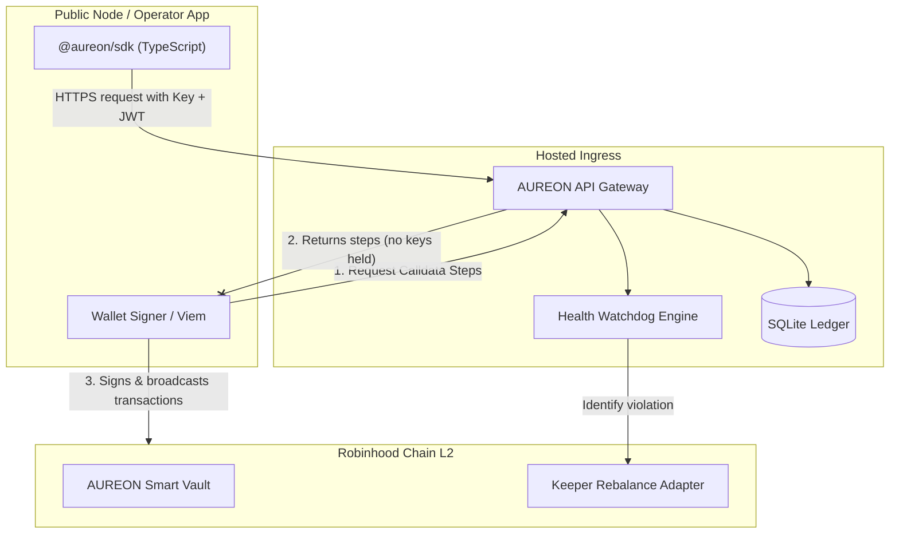
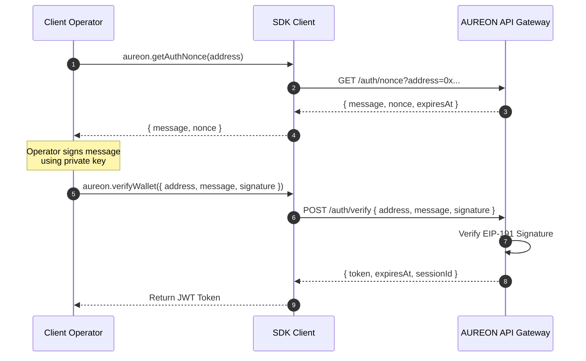
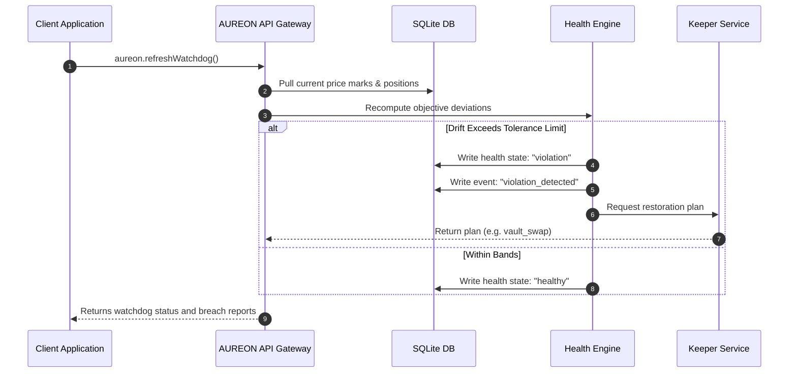

<div align="center">

# Aureon

**Financial Intelligence Layer for Onchain AI Agents**

The official TypeScript HTTP client for the AUREON API.
Financial Compass, capital health, and verified restore plans: one typed integration surface.

<br />

[](https://www.typescriptlang.org/)
[](#requirements)
[](https://github.com/buildaureon)
[](LICENSE)
[](#requirements)

<br />

```bash
pnpm add @aureon/sdk
```

[Quickstart](#quickstart) · [Authentication](#authentication) · [API Surface](#api-surface) · [Docs](#documentation)

</div>

---

## Table of Contents

1. [What is AUREON?](#what-is-aureon)
2. [Requirements & Installation](#requirements--installation)
3. [Architecture & System Flow](#architecture--system-flow)
    - [3.1 Client-API Trust Boundary](#31-client-api-trust-boundary)
    - [3.2 Session Authentication Flow](#32-session-authentication-flow)
    - [3.3 Rebalancing & Watchdog Execution Flow](#33-rebalancing--watchdog-execution-flow)
4. [Quickstart](#quickstart-1)
5. [Detailed Authentication Guide](#detailed-authentication-guide)
    - [5.1 API Keys](#51-api-keys)
    - [5.2 Wallet Bearer Handshake](#52-wallet-bearer-handshake)
    - [5.3 Token Provider Lifecycle](#53-token-provider-lifecycle)
6. [API Surface Reference & Code Walkthroughs](#api-surface-reference--code-walkthroughs)
    - [6.1 Connection Smoke Tests](#61-connection-smoke-tests)
    - [6.2 Managing the Capital Book](#62-managing-the-capital-book)
    - [6.3 Defining and Querying Objectives](#63-defining-and-querying-objectives)
    - [6.4 Evaluating Compliance, Health, and Timeline Logs](#64-evaluating-compliance-health-and-timeline-logs)
    - [6.5 Non-Custodial Vault Operations](#65-non-custodial-vault-operations)
    - [6.6 Executing Restore Plans & Rebalances](#66-executing-restore-plans--rebalances)
    - [6.7 Simulating Market Events](#67-simulating-market-events)
    - [6.8 Developer API Key Management](#68-developer-api-key-management)
7. [Client Configuration & Transport Engine](#client-configuration--transport-engine)
    - [7.1 Configuration Reference Table](#71-configuration-reference-table)
    - [7.2 Retries and Network Failover](#72-retries-and-network-failover)
8. [Error Model and Code Handling](#error-model-and-code-handling)
    - [8.1 Error Code Reference Matrix](#81-error-code-reference-matrix)
    - [8.2 Narrowing Errors in Practice](#82-narrowing-errors-in-practice)
9. [CLI Command-Line Guide](#cli-command-line-guide)
10. [Design Principles & Settlement Honesty](#design-principles--settlement-honesty)
11. [Documentation Registry Map](#documentation-registry-map)

---

## What is AUREON?

**AUREON** is a policy and execution layer for capital on **Robinhood Chain**. Traditional web3 interactions are transactional: an operator submits a single swap or deposit instruction, and once settled, the system forgets the broader goal. 

AUREON introduces **Financial Compass Objectives (FCOs)** as execution primitives. Instead of sending raw transactions, developers register continuous financial rules (e.g., "maintain a stable coin buffer at 25% of total portfolio value"). The AUREON system:

* Monitors capital holdings across active addresses and smart vault contracts.
* Computes live portfolio value using public market data.
* Detects allocation breaches against registered objective bands.
* Produces recovery instructions (e.g., wrap/unwrap transactions or keeper-driven vault swaps).
* Maintains a cryptographic, append-only timeline of compliance audits.



---

## Requirements & Installation

### Requirements
* **Node.js** version 20 or higher (ESM environment).
* **Viem** (version 2.x) if signing and broadcasting transaction steps is required.

### Installation
Add the package to your project using a package manager:

```bash
# Using pnpm
pnpm add @aureon/sdk

# Using npm
npm install @aureon/sdk

# Using yarn
yarn add @aureon/sdk
```

---

## Architecture & System Flow

### 3.1 Client-API Trust Boundary
To protect user funds, AUREON uses a decoupled trust boundary. The hosted API handles monitoring, calculations, public oracle pricing, and rebalance coordination, while private keys remain with the client.

| Layer | Responsibility |
|---|---|
| **SDK** | Request transport, EIP-712 hashing utilities, parameter validation, retry backing, and vault deposit/withdrawal calldata construction. |
| **AUREON API** | Ledger syncing, objective validation logic, public price marks tracking, execution timeline compilation, and stage rebalance management. |
| **Host Application** | Private key storage, MetaMask/signer integrations, and transaction signing & broadcasting. |

---

### 3.2 Session Authentication Flow
Authentication requires a challenge-response signature verification to link a wallet address with a temporary JWT session.



---

### 3.3 Rebalancing & Watchdog Execution Flow
When portfolio weights drift, the system triggers a rebalance using the execution flow:



---

## Quickstart

Initialize the SDK, retrieve a signing nonce, verify the signature, and sync wallet positions:

```ts
import { createAureonClient, createSessionTokenProvider } from "@aureon/sdk";
import { privateKeyToAccount } from "viem/accounts";
import { createWalletClient, http } from "viem";

async function run() {
  // 1. Setup session token container
  const session = createSessionTokenProvider(null);
  
  // 2. Initialize the client
  const aureon = createAureonClient({
    baseUrl: "https://api.aureonlabs.network",
    apiKey: process.env.AUREON_API_KEY!,
    getAccessToken: session.getAccessToken,
  });

  // 3. Perform a handshake to authenticate
  const account = privateKeyToAccount("0x..."); // Operator private key
  const { message } = await aureon.getAuthNonce(account.address);
  
  const walletClient = createWalletClient({ account, transport: http() });
  const signature = await walletClient.signMessage({ message, account });
  
  const login = await aureon.verifyWallet({
    address: account.address,
    message,
    signature,
  });
  
  // 4. Save credentials
  session.setToken(login.token);

  // 5. Query portfolio status
  const synced = await aureon.syncPortfolio();
  console.log("Portfolio Value USD:", synced.portfolio.totalNotionalUsd);
}
```

---

## Detailed Authentication Guide

### 5.1 API Keys
API keys regulate product access at the gateway level. They must be sent with all client requests via the `X-Aureon-Api-Key` header. Generate new API keys inside the operator utility developer console.

### 5.2 Wallet Bearer Handshake
Bearer sessions scope data operations to a specific wallet. The SDK client obtains a nonce, signs it using an EVM signer, and posts the signature back to `/auth/verify` to receive a JWT session token.

### 5.3 Token Provider Lifecycle
The `createSessionTokenProvider` manager handles token resolution and injection. It can be passed directly as a resolver function:

```ts
import { createSessionTokenProvider } from "@aureon/sdk";

const session = createSessionTokenProvider(process.env.AUREON_TOKEN ?? null);

// Clear tokens on logout
await aureon.logout();
session.clear();
```

---

## API Surface Reference & Code Walkthroughs

### 6.1 Connection Smoke Tests
```ts
const ping = await aureon.ping();
console.log(`Connected. Backend version: ${ping.version}`);
```

### 6.2 Managing the Capital Book
The Capital Book defines the assets tracked by AUREON. Sync positions from the chain or modify them directly:

```ts
// Sync active balances from Robinhood Chain L2 and smart vaults
const syncResult = await aureon.syncPortfolio();
console.log("Current stable coin weight:", syncResult.portfolio.stableWeight);

// Manually define positions (useful for simulation environments)
const updatedBook = await aureon.setPortfolio([
  { symbol: "WETH", quantity: 2.5, category: "gas" },
  { symbol: "USDG", quantity: 2500, category: "stable" }
]);

// Clear all active ledger tracking rows
await aureon.clearPortfolio();
```

### 6.3 Defining and Querying Objectives
Objectives dictate the target weights and tolerance buffers. All SDK objectives are initialized with automatic rebalancing:

```ts
// Create a stable coin allocation objective
const stableObj = await aureon.createObjective({
  name: "Stable Core Reserve",
  kind: "stable_allocation",
  targetWeight: 0.30,  // Keep 30% of portfolio value in stables
  tolerance: 0.03,     // Rebalance if drift exceeds +/- 3%
  priority: "high"
});

// Create a stock token tracking objective
const stockObj = await aureon.createObjective({
  name: "Tesla Sleeve Allocation",
  kind: "balanced_portfolio",
  targetSymbol: "TSLA",
  targetWeight: 0.20,
  tolerance: 0.05
});

// List objectives registered to the authenticated wallet
const objectives = await aureon.listObjectives();
```

### 6.4 Evaluating Compliance, Health, and Timeline Logs
```ts
// Get active health states for all objectives
const healthRecords = await aureon.getHealth();
for (const health of healthRecords) {
  console.log(`Objective ${health.objectiveId}: State: ${health.state}`);
}

// Fetch timeline events (logs objective updates, breaches, and rebalances)
const timeline = await aureon.getTimeline();
timeline.forEach(event => console.log(`[${event.type}]: ${event.message}`));

// Fetch general dashboard overview metrics
const overview = await aureon.getOverview();
console.log("Global health score:", overview.globalHealthScore);
```

### 6.5 Non-Custodial Vault Operations
Vault interactions construct raw transactions (calldatas) locally. The host application signs and broadcasts these to execute actions:

```ts
import { Hex } from "viem";

// 1. Prepare vault deposit parameters
const depositData = await aureon.prepareVaultDeposit({
  symbol: "ETH",
  amount: "0.5",
});

// 2. Iterate and sign calldata steps
for (const step of depositData.steps) {
  const hash = await walletClient.sendTransaction({
    account,
    to: step.to as `0x${string}`,
    data: step.data as Hex,
    value: BigInt(step.value),
  });
  await publicClient.waitForTransactionReceipt({ hash });
}
```

### 6.6 Executing Restore Plans & Rebalances
If a deviation triggers a breach, fetch the restore instructions:

```ts
// 1. Fetch recovery plan details
const plan = await aureon.getRestorePlan(objective.id);
console.log(`Plan requires action: ${plan.kind} for ${plan.amountHuman} tokens.`);

// 2. Perform restoration
if (plan.kind === "vault_swap") {
  // Vault swaps are handled directly on the backend
  const receipt = await aureon.restoreObjective(objective.id);
  console.log("Rebalance transaction hash:", receipt.transactionHash);
  console.log("Settlement environment:", receipt.settlement); // "vault" or "staged"
} else {
  // ETH wraps or WETH unwraps are executed client-side
  console.warn("Execute wrap_eth or unwrap_weth using your wallet provider.");
}
```

### 6.7 Simulating Market Events
Trigger price changes to test rebalancing routines:

```ts
// Trigger a mock 15% drop in NVDA's price mark
const shockResult = await aureon.applyMarketEvent({
  symbol: "NVDA",
  priceChangeRatio: -0.15,
  autoRestore: true, // Trigger staged/vault restorations automatically if a breach occurs
});
```

### 6.8 Developer API Key Management
Generate, toggle, and revoke keys:

```ts
// Generate a new key (Store the returned plain-text 'secret' immediately)
const newKey = await aureon.createApiKey("Secondary Bot Ingress");
console.log(`Plaintext secret: ${newKey.secret}`);

// List active keys
const keys = await aureon.listApiKeys();

// Toggle active/inactive state
await aureon.toggleApiKey(newKey.id);

// Revoke a key
await aureon.revokeApiKey(newKey.id);
```

---

## Client Configuration & Transport Engine

### 7.1 Configuration Reference Table
Pass these parameters inside the `AureonClientOptions` constructor payload:

| Parameter | Type | Default | Description |
|---|---|---|---|
| `baseUrl` | `string` | `"https://api.aureonlabs.network"` | Target API ingress endpoint |
| `apiKey` | `string` | `undefined` | Key sent with `X-Aureon-Api-Key` headers |
| `authToken` | `string` | `undefined` | Static JWT bearer token |
| `getAccessToken` | `() => string \| null` | `undefined` | Dynamic getter function resolving bearer tokens |
| `timeoutMs` | `number` | `30000` | Abort threshold per network call |
| `maxRetries` | `number` | `0` | Re-attempt counts for transport failures |
| `retryDelayMs` | `number` | `250` | Wait delay between retry loops |
| `headers` | `Record<string, string>` | `{}` | Key-value headers appended to requests |
| `fetch` | `typeof fetch` | `globalThis.fetch` | Custom fetch wrapper engine overrides |

---

### 7.2 Retries and Network Failover
When `maxRetries` is greater than `0`, the client retries failed requests if it encounters a transient error (such as a timeout or a 503 HTTP status code). Retries use a fixed delay (`retryDelayMs`).

---

## Error Model and Code Handling

### 8.1 Error Code Reference Matrix

| Code | HTTP Status | Description |
|---|---|---|
| `UNAUTHORIZED` | 401 | Missing or invalid API key or Bearer token |
| `VALIDATION_ERROR`| 400 | Payload fails validation (e.g. name length or targetWeight bounds) |
| `NOT_FOUND` | 404 | Target object (objective, key, etc.) does not exist |
| `CONFLICT` | 409 | Request conflicts with current database state |
| `RATE_LIMITED` | 429 | Request count exceeds API limits |
| `SERVER_ERROR` | 500 / 503 | Server-side execution failure |
| `TIMEOUT` | N/A | Call exceeded client-configured `timeoutMs` |
| `NETWORK_ERROR` | N/A | Endpoint unreachable or client is offline |

---

### 8.2 Narrowing Errors in Practice
AUREON methods throw custom error instances. Wrap calls in a try/catch block and use `isAureonError` to handle them:

```ts
import { isAureonError } from "@aureon/sdk";

try {
  const objective = await aureon.getObjective("missing_id");
} catch (error) {
  if (isAureonError(error)) {
    switch (error.code) {
      case "NOT_FOUND":
        console.error("The specified objective does not exist.");
        break;
      case "UNAUTHORIZED":
        console.error("Check your API key and wallet session configuration.");
        break;
      default:
        console.error(`Aureon error: ${error.message}`);
    }
  } else {
    console.error("Generic execution failure:", error);
  }
}
```

---

## CLI Command-Line Guide

The SDK package includes a developer CLI utility. Provide configuration values using environment variables:

```bash
export AUREON_API_KEY=your_key
export AUREON_TOKEN=your_bearer_token

# Verify connection
pnpm --filter @aureon/sdk cli ping

# Fetch current account metadata
pnpm --filter @aureon/sdk cli me

# Synchronize current on-chain balances
pnpm --filter @aureon/sdk cli sync

# Print Capital Book portfolio weights
pnpm --filter @aureon/sdk cli portfolio

# List all registered objectives
pnpm --filter @aureon/sdk cli objectives
```

---

## Design Principles & Settlement Honesty

1. **Non-Custodial Design**: Private keys never leave the client application. The AUREON API gateway only receives signature verification requests and constructs unsigned transaction payloads.
2. **Settlement Transparency**: Execution receipts include a `settlement` attribute (`"staged"` or `"vault"`).
    * `"vault"` indicates the transaction settled on-chain on Robinhood Chain L2.
    * `"staged"` indicates a local ledger update only. Staged transactions must be labeled transparently in user interfaces.
3. **Seeded Ledger Capital**: Position data comes from synchronized block queries or explicit operator inputs. The SDK does not fabricate capital balances.

---

## Documentation Registry Map

For more detail, refer to the documents inside the `sdk/docs/` directory:

| Document | Focus |
|---|---|
| [docs/architecture.md](docs/architecture.md) | Client vs API boundary lines and system maps |
| [docs/auth.md](docs/auth.md) | Wallet handshake, signature verifications, and JWT lifecycles |
| [docs/client-api.md](docs/client-api.md) | Detailed parameter index for all client methods |
| [docs/data-contracts.md](docs/data-contracts.md) | Type index matching hosted JSON endpoints |
| [docs/error-model.md](docs/error-model.md) | Complete error code listing and code mappings |
| [docs/integration-guide.md](docs/integration-guide.md) | End-to-end integration walkthroughs |
| [docs/security.md](docs/security.md) | API key and token security guidelines |
| [docs/transport.md](docs/transport.md) | Transport configurations, retry loops, and error-handling |

---

## Community & Resources

* **Official Website**: [aureonlabs.network](https://aureonlabs.network)
* **Operator Utility Platform**: [app.aureonlabs.network](https://app.aureonlabs.network)
* **Twitter / X**: [@buildaureon](https://x.com/buildaureon)
* **GitHub Repository**: [github.com/buildaureon](https://github.com/buildaureon)

