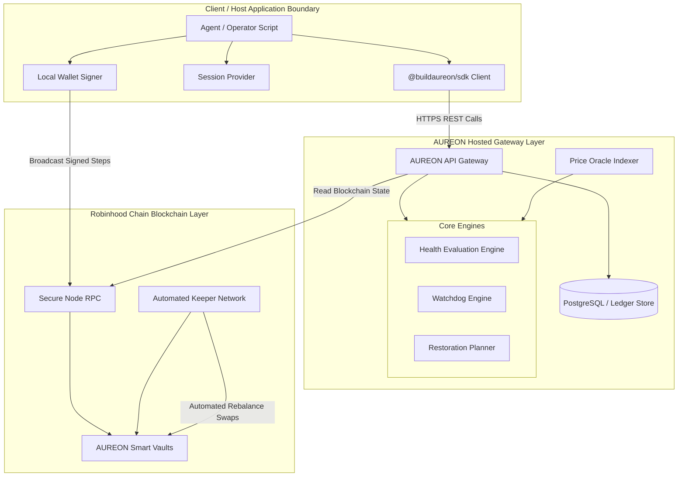
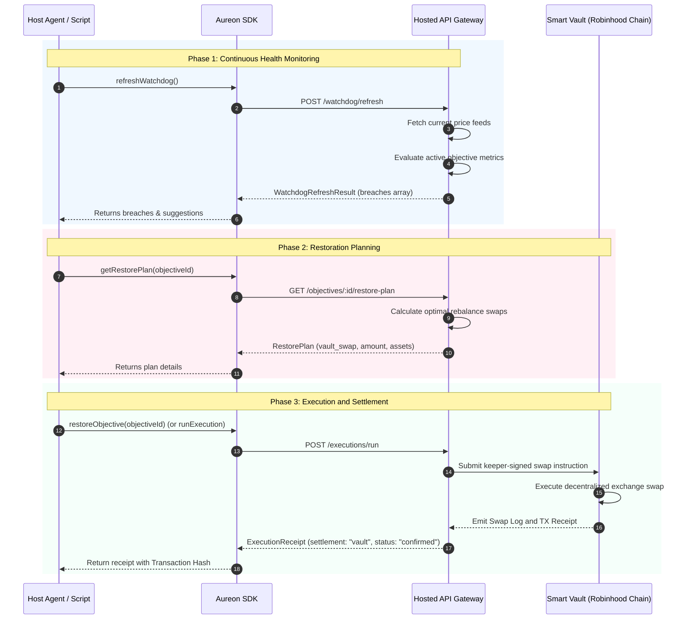
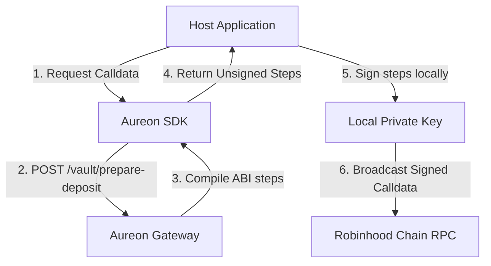

# Architecture Guide

This document provides a detailed breakdown of the AUREON system architecture. It outlines the components, data models, state machines, and cryptographic boundaries that govern the `@buildaureon/sdk` and its integration with the hosted AUREON API and the Robinhood Chain.

---

## 1. System Vision and Core Principles

AUREON acts as a decentralized, non-custodial "Financial Compass" (FCO) for digital assets. Instead of requiring users to execute manual, repetitive rebalancing trades or entrust their private keys to a centralized custodian, AUREON splits the system responsibilities:
1.  **Continuous Policy Tracking**: The AUREON Health and Watchdog Engines continuously monitor capital allocations against user-defined objectives (e.g. maintaining a 20% stablecoin sleeve).
2.  **Non-Custodial execution**: When allocations drift outside the allowed tolerance, the system generates execution plans. Rebalances are executed on-chain via Smart Vaults, but transaction signatures are produced locally by the user's wallet.

---

## 2. Component Architecture Overview

The system is organized into three major layers: the **Client Layer** (where the SDK resides), the **Gateway Layer** (which hosts the policy and pricing engines), and the **On-chain Layer** (where actual capital is settled).

### 2.1 The Client Layer
*   **AureonClient**: The main class exported by `@buildaureon/sdk`. It coordinates REST requests, implements pre-flight input validation, maps HTTP errors to TypeScript classes, and manages retries.
*   **Session Token Provider**: A stateful container that maintains the ephemeral JSON Web Token (JWT) retrieved during wallet signature verification.
*   **Local Wallet Signer**: A private key management module (e.g. Viem, Ethers, or an HSM) controlled by the integrator. It signs transaction steps returned by the vault preparation endpoints.

### 2.2 The Hosted Gateway Layer
*   **API Gateway**: A Hono-based router exposing endpoints for managing objectives, synchronizing portfolio snapshots, preparing vault transactions, and querying timeline events.
*   **Ledger Store**: A persistent relational database storing user-configured objectives, historic portfolio snapshots, execution receipts, and audit event logs.
*   **Price Oracle Indexer**: Integrates with chain feeds to maintain real-time price feeds for all allowlisted vault assets.
*   **Health Evaluation Engine**: Computes asset weights and checks deviations against objective targets.
*   **Watchdog Engine**: Orchestrates the cron-like heartbeat check to verify if any active objective has entered a violation state.
*   **Restoration Planner**: Computes the trade sizes and asset swaps needed to return a violating objective back to its target policy.

### 2.3 The On-chain Layer
*   **AUREON Smart Vaults**: ERC-20 and ERC-4626 compatible smart contracts deployed on the Robinhood Chain. They hold the user's custody-free rebalancing capital.
*   **Automated Keeper Network**: Off-chain worker bots that listen for restoration plans, call the smart vaults with keeper signatures, and execute swaps via decentralized liquidity pools.

---

## 3. The Rebalancing Lifecycle

Rebalancing is the process of moving an objective from a `violation` state back to a `healthy` state. The lifecycle involves multiple steps between the SDK, the gateway, and the blockchain.

### 3.1 Step 1: Heartbeat Evaluation
The agent periodically calls `refreshWatchdog()`. The gateway retrieves the current token balances in the user's smart vault, fetches real-time mark prices, and computes the current allocation percentage.

### 3.2 Step 2: Breach Detection
If the current allocation drifts beyond the tolerance window, the Health Engine flags the objective's state as `violation` and creates a `TimelineEvent` of type `violation_detected`.

### 3.3 Step 3: Plan Generation
The restoration planner calculates the difference between the current weight and the target weight. It translates this difference into a target amount of tokens to buy or sell, package-wrapped inside a `RestorePlan`.

### 3.4 Step 4: Execution
For automated objectives, calling `restoreObjective` instructs the gateway to dispatch a keeper rebalance transaction. The vault executes the trade using native liquidity, updating the token weights on-chain.

### 3.5 Step 5: Confirmation
The transaction completes on the Robinhood Chain, and the gateway records an `ExecutionReceipt` with `settlement: "vault"` and `status: "confirmed"`, marking the objective status back to `healthy`.

---

## 4. Subsystem Details

### 4.1 Health Evaluation Formulas
The Health Engine evaluates each of the four objective types using specific mathematical parameters:

1.  **Stable Allocation (`stable_allocation`)**:
    *   **Metric**: $W_{stable} = \frac{\sum \text{Notional}(StableCoins)}{\text{Total Portfolio Notional}}$
    *   **Condition**: Target Weight $T$ and Tolerance $t$. The sleeve is healthy if $|W_{stable} - T| \le t$.
    *   **Breach**: If $W_{stable} > T + t$, the planner generates a plan to sell stables. If $W_{stable} < T - t$, the planner generates a plan to buy stables.

2.  **Balanced Portfolio (`balanced_portfolio`)**:
    *   **Metric**: $W_{targetSymbol} = \frac{\text{Notional}(TargetSymbol)}{\text{Total Portfolio Notional}}$
    *   **Condition**: Target Weight $T$ and Tolerance $t$.
    *   **Breach**: Triggers rebalancing if the target asset drifts outside the tolerance window.

3.  **Risk Ceiling (`risk_ceiling`)**:
    *   **Metric**: $\text{RiskScore} = \sum (W_{asset} \times \text{VolatilityRisk}(Asset))$
    *   **Condition**: Risk Score must remain below $\text{maxRiskScore}$.
    *   **Breach**: Generates plans to swap highly volatile assets for stable assets if the portfolio risk exceeds the ceiling.

4.  **Reward Reinvestment (`reward_reinvestment`)**:
    *   **Metric**: $\text{AccumulatedRewards}$
    *   **Condition**: Automatically sweeps yield generated by vault positions.
    *   **Breach**: Triggers when accrued reward tokens exceed a cost-effective gas threshold, reinvesting them into the target sleeve.

### 4.2 Non-Custodial Vault Deposits and Withdrawals
While rebalancing is handled by automated keepers, adding or removing funds from the vault requires manual developer wallet signatures.

1.  **Allowance Validation**: The SDK checks if the vault contract is approved to spend the target token. If not, it includes an `approve` step.
2.  **Deposit Compilation**: The gateway builds the transaction data for `deposit(amount)` or `depositETH(value)` calls.
3.  **Execution**: The host signs and broadcasts the steps. The vault smart contract issues shares to the user's address, which are subsequently indexed by the gateway's sync loops.

---

## 5. Trust and Security Postures

Integrators must understand the boundary lines between AUREON infrastructure and host applications:

*   **API Key Scope**: API keys authenticate gateway access but cannot perform asset transfers. Compromising an API key does not give access to vault funds because withdrawals require direct owner signatures.
*   **Signature Isolation**: Transactions are signed client-side. `@buildaureon/sdk` does not expose methods for loading private keys, keeping key storage isolated.
*   **Keeper Swaps**: Keepers can only execute swaps within the allowlisted trading paths of the smart vault. They cannot transfer vault assets to third-party addresses.

---

## 6. Network Specifications

AUREON is deployed on the following network infrastructure:

*   **Chain Name**: Robinhood Chain Testnet
*   **Chain ID**: `46630`
*   **Gas Token**: Native WETH / ETH
*   **Block Explorer**: `https://explorer.robinhoodnet.org`
*   **Oracles**: Private decentralized feeds push updates to vault-registered adapter contracts.
