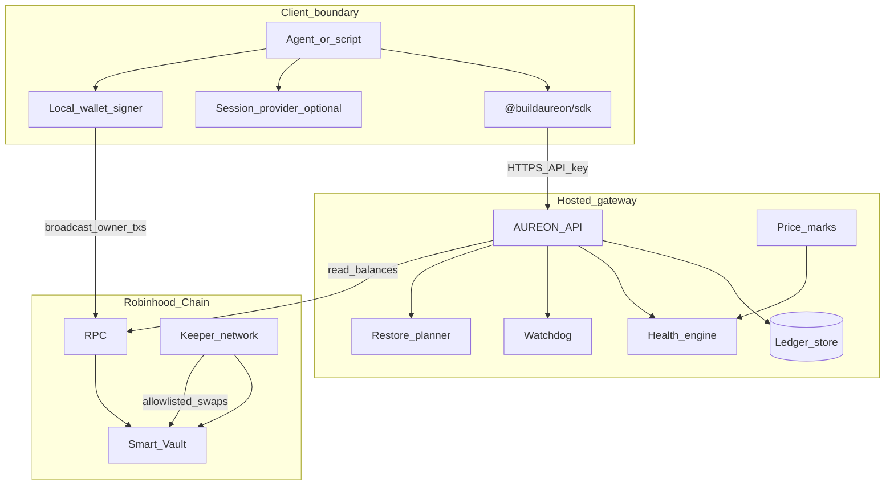
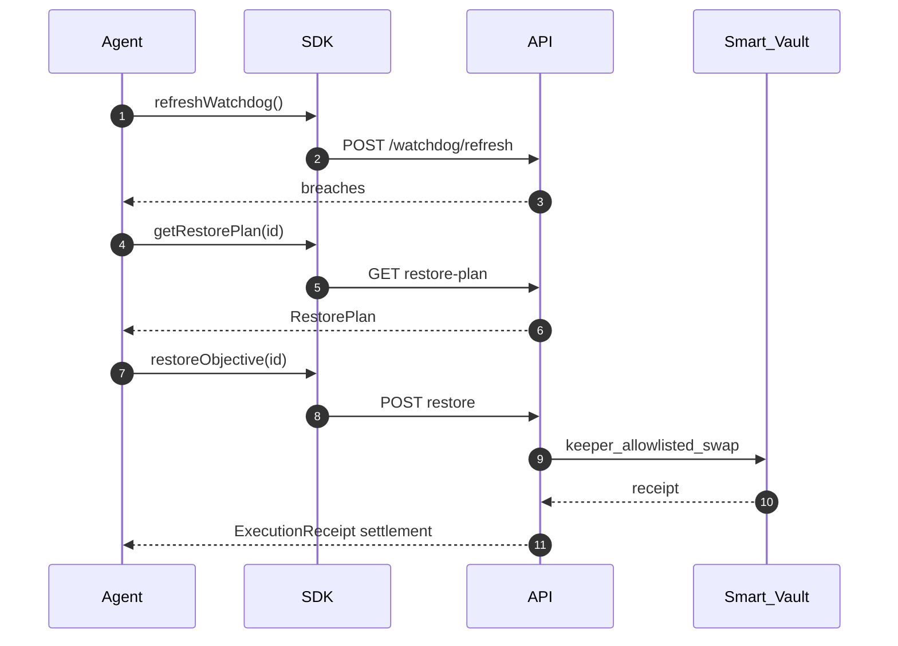
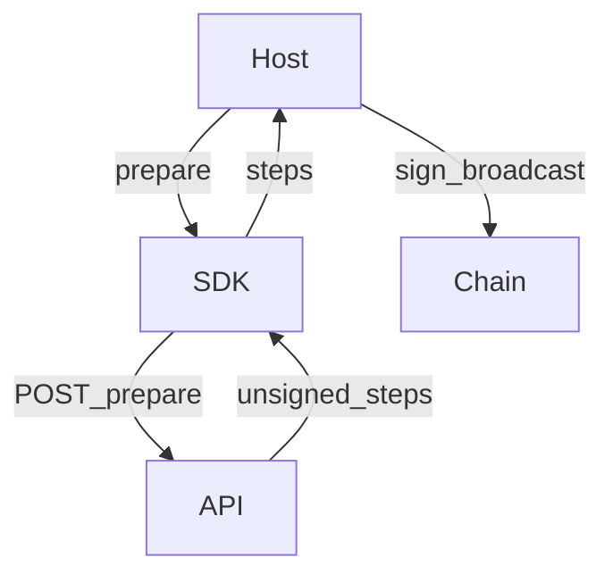

# Architecture Guide

System architecture for AUREON and how `@buildaureon/sdk` fits as the typed client for Automatic agent workflows.

**Automation note:** The SDK is built for **Automatic** objectives (`automationMode: "auto"`). Manual Approve operator flows are handled in the utility, not as the primary SDK architecture.

---

## 1. Vision

AUREON is a non-custodial Financial Compass for onchain agents on Robinhood Chain:

1. **Persistent policy** — objectives define target weights / risk bands and stay registered.
2. **Continuous health** — watchdog + marks detect drift past tolerance.
3. **Honest restore** — plans and receipts (`settlement: vault | staged`) make settlement transparent.
4. **Local signing** — owner deposits/withdraws are prepared by the API and signed by the host.

---

## 2. Component layers

### 2.1 Client layer (`@buildaureon/sdk`)

| Piece | Role |
| --- | --- |
| `AureonClient` | Typed REST client, validation, retries, error mapping |
| Issued API key | Wallet identity for control plane |
| Session provider | Optional Bearer for utility-style sessions |
| Host signer | Broadcasts prepare-deposit / prepare-withdraw steps |

### 2.2 Gateway layer

| Piece | Role |
| --- | --- |
| API | Objectives, portfolio sync, vault prepare, restore, timeline |
| Ledger | Objectives, health snapshots, receipts, events |
| Marks | Price inputs for weight math |
| Health engine | Compares weights / risk to policy |
| Watchdog | Heartbeat evaluation across active Auto objectives |
| Planner | Builds restore plans (e.g. vault_swap) |

### 2.3 On-chain layer

| Piece | Role |
| --- | --- |
| Smart Vault | Holds rebalancing capital under owner + keeper rules |
| Keepers | Execute Automatic restore swaps on allowlisted routes |
| Owner txs | Deposit / withdraw via signed prepare steps |

---

## 3. Automatic restore lifecycle

1. **Evaluate** — sync vault + wallet marks, compute weights.
2. **Detect** — if `|current - target| > tolerance`, health → `violation`.
3. **Plan** — planner emits a restore plan (often `vault_swap`).
4. **Execute** — Automatic restore coordinates keeper vault execution.
5. **Confirm** — receipt + timeline; health returns toward `healthy` when sizing/liquidity succeed.

### Capital book vs vault

- **Capital Book** — gateway portfolio used for weight math (`syncPortfolio`).
- **Vault balances** — on-chain capital Automatic restores trade against.
- Empty vault ⇒ Automatic restores cannot meaningfully settle on-chain even if policy exists.

---

## 4. Health evaluation (summary)

| Kind | Core idea |
| --- | --- |
| `stable_allocation` | Stable sleeve weight vs target ± tolerance |
| `balanced_portfolio` | `targetSymbol` weight vs target ± tolerance |
| `risk_ceiling` | Aggregate risk score vs `maxRiskScore` |
| `reward_reinvestment` | Accrued rewards above actionable threshold |

Exact fields live in [data-contracts.md](./data-contracts.md).

---

## 5. Objective immutability

At create time the SDK records:

- `targetSymbol` (optional / required by kind)
- `automationMode` (SDK default **`auto`**)

Neither can be patched later via `updateObjective`. Recreate to change token or mode. Updates may change name, weights, tolerance, priority, and kind-specific numeric fields.

---

## 6. Non-custodial deposit / withdraw

1. Host calls `prepareVaultDeposit` / `prepareVaultWithdraw`.
2. API returns approve + deposit/withdraw steps as needed.
3. Host signs and broadcasts.
4. Later `syncPortfolio` / `getVault` reflect chain state.

---

## 7. Trust posture

| Claim | Reality |
| --- | --- |
| API key steals funds | No — cannot sign owner withdrawals |
| Keeper steals funds | No — allowlisted swaps only |
| Staged = on-chain | No — label `settlement` honestly |
| SDK holds keys | No — host signer only |

---

## 8. Network (early access testnet)

| Item | Value |
| --- | --- |
| Chain | Robinhood Chain testnet |
| Chain ID | `46630` |
| API | `https://api.aureonlabs.network` |
| Explorer | Configure via product / env (`AUREON_EXPLORER_BASE`) |

Confirm live addresses and allowlisted symbols from the operator utility and API responses — do not hardcode stale addresses in agents.

---

## 9. Related docs

- [Integration guide](./integration-guide.md)
- [Auth](./auth.md)
- [Security](./security.md)
- [Client API](./client-api.md)
- [Data contracts](./data-contracts.md)
