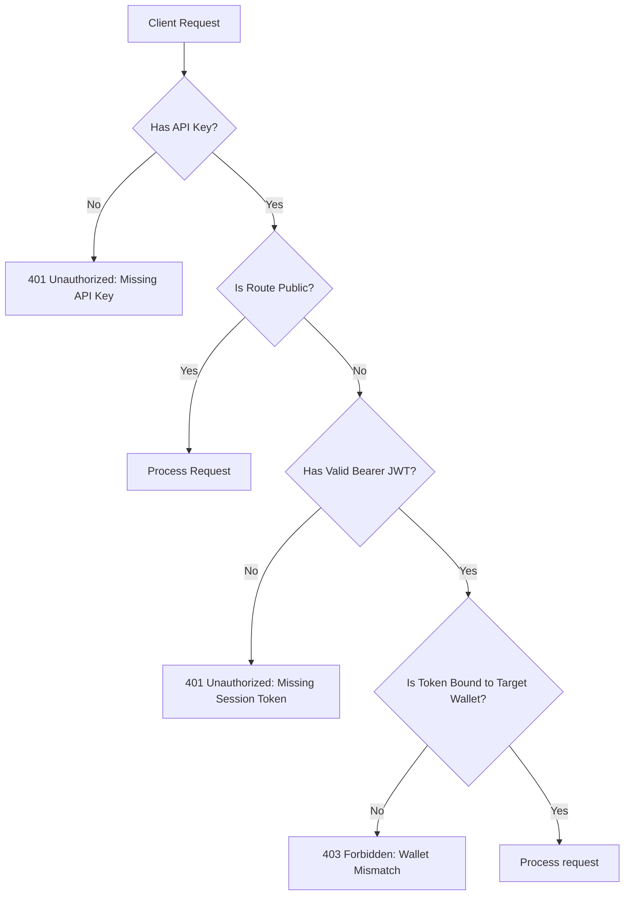
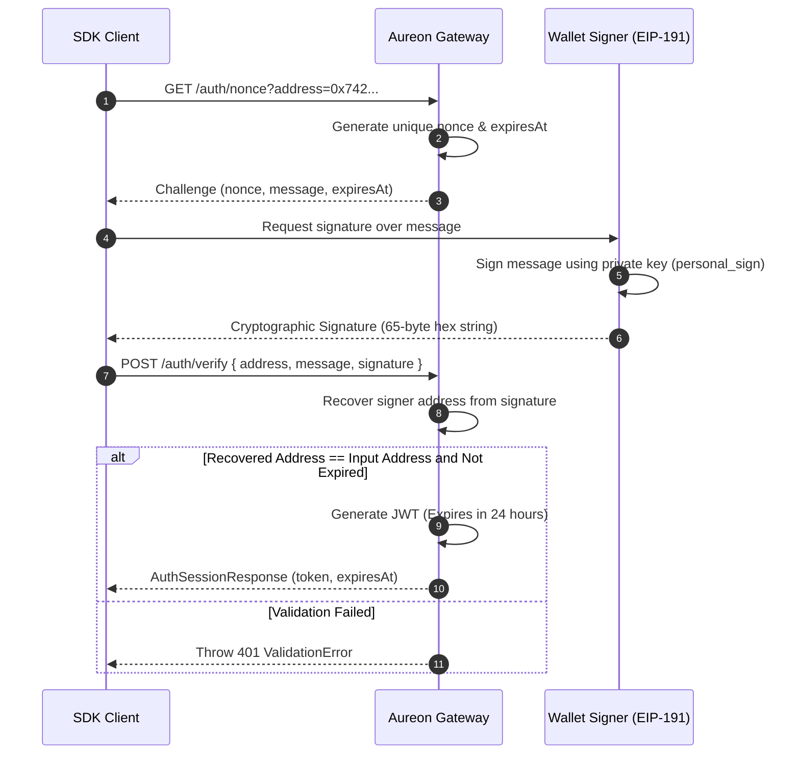

# Cryptographic Authentication Guide

AUREON combines classic API authentication with Web3 signature verification. This guide provides an in-depth technical explanation of the handshake flow, JWT payloads, and client integrations using standard EVM libraries.

---

## 1. Authentication Topology

Requests are validated using a dual-token header model. 



*   **API Key (`X-Aureon-Api-Key`)**: Sent in the headers to identify your product subscription or server deployment. It is generated in the developer dashboard.
*   **Bearer JWT (`Authorization: Bearer <token>`)**: Establishes session ownership. It is generated dynamically by signing a server-issued challenge message with your private key.

---

## 2. EIP-191 Cryptographic Handshake

The signature validation relies on the EIP-191 standard for signing personal messages. The process prevents replay attacks and ensures session integrity.



### 2.1 The Challenge Message Schema
The message returned by `/auth/nonce` follows a strict structure:
```text
AUREON Login Challenge
Wallet: 0x742d35Cc6634C0532925a3b844Bc454e4438f44e
Nonce: c8a99478fcd9185a494f
Timestamp: 2026-07-15T22:45:00.000Z
Expires: 2026-07-15T22:50:00.000Z

Sign this message to prove ownership of the wallet.
```
*   **Nonce**: A cryptographically secure random string preventing replay attacks.
*   **Expires**: The timestamp (5-minute TTL) after which the challenge becomes invalid.

---

## 3. JWT Payload Structure

Upon successful signature recovery, the gateway issues a JSON Web Token containing the session metadata:

```json
{
  "sub": "0x742d35cc6634c0532925a3b844bc454e4438f44e",
  "iss": "aureon-auth-service",
  "iat": 1784155500,
  "exp": 1784241900,
  "sid": "sess_01h8v12x8p8p3z2v1q45r3m2e1",
  "scope": "operator"
}
```

*   **`sub` (Subject)**: The lowercase Ethereum address of the authenticated wallet.
*   **`exp` (Expiration)**: Unix timestamp set exactly 24 hours after token issuance.
*   **`scope`**: Defines operational permissions (e.g. `operator`, `read-only`).

---

## 4. Multi-Framework Integration Examples

### 4.1 Integration via Viem (TypeScript / Node.js)
Ideal for background cron daemons, keepers, and automated scripts.

```ts
import { createAureonClient, createSessionTokenProvider } from "@buildaureon/sdk";
import { createWalletClient, http } from "viem";
import { privateKeyToAccount } from "viem/accounts";
import { mainnet } from "viem/chains";

async function authenticateAgent() {
  const account = privateKeyToAccount(process.env.PRIVATE_KEY as `0x${string}`);
  const wallet = createWalletClient({
    account,
    chain: mainnet,
    transport: http()
  });

  const session = createSessionTokenProvider(null);
  const aureon = createAureonClient({
    apiKey: process.env.AUREON_API_KEY,
    getAccessToken: session.getAccessToken
  });

  // 1. Get nonce
  const { message } = await aureon.getAuthNonce(account.address);

  // 2. Sign EIP-191 message
  const signature = await wallet.signMessage({ message });

  // 3. Verify on server
  const login = await aureon.verifyWallet({
    address: account.address,
    message,
    signature
  });

  session.setToken(login.token);
  return aureon;
}
```

### 4.2 Integration via Ethers.js v6
Useful for traditional Node.js servers or scripts using Ethers.

```ts
import { createAureonClient, createSessionTokenProvider } from "@buildaureon/sdk";
import { Wallet } from "ethers";

async function authenticateEthers() {
  const wallet = new Wallet(process.env.PRIVATE_KEY!);
  const session = createSessionTokenProvider(null);
  const aureon = createAureonClient({
    apiKey: process.env.AUREON_API_KEY,
    getAccessToken: session.getAccessToken
  });

  const { message } = await aureon.getAuthNonce(wallet.address);
  const signature = await wallet.signMessage(message);

  const login = await aureon.verifyWallet({
    address: wallet.address,
    message,
    signature
  });

  session.setToken(login.token);
  return aureon;
}
```

### 4.3 Integration in Browser Frontends (window.ethereum)
Suitable for operator portals and user-facing dashboards.

```ts
import { createAureonClient, createSessionTokenProvider } from "@buildaureon/sdk";

async function loginBrowser() {
  if (!window.ethereum) throw new Error("No provider found");

  const [address] = await window.ethereum.request({ method: "eth_requestAccounts" });
  const session = createSessionTokenProvider(localStorage.getItem("aureon_token"));
  
  const aureon = createAureonClient({
    apiKey: process.env.AUREON_API_KEY,
    getAccessToken: session.getAccessToken
  });

  try {
    // Validate current token
    await aureon.me();
  } catch (err) {
    // Fetch new challenge
    const { message } = await aureon.getAuthNonce(address);

    // Sign using browser extension wallet
    const signature = await window.ethereum.request({
      method: "personal_sign",
      params: [message, address]
    });

    const login = await aureon.verifyWallet({ address, message, signature });
    session.setToken(login.token);
    localStorage.setItem("aureon_token", login.token);
  }

  return aureon;
}
```

---

## 5. Token Lifecycle and Recovery

*   **Handling Token Expirations**: When a session token expires, the gateway returns a `401 UNAUTHORIZED` error. Integrators should register a callback in their request loops to renew the token automatically.
*   **Multi-Wallet Routing**: If your application manages multiple vaults, instantiate separate `AureonClient` instances for each session token provider. Portfolios are partitioned by wallet address.
*   **Logout Mechanics**: Invoking `aureon.logout()` invalidates the JWT on the gateway. The local cache should be cleared immediately:
    ```ts
    await aureon.logout();
    session.clear();
    localStorage.removeItem("aureon_token");
    ```
