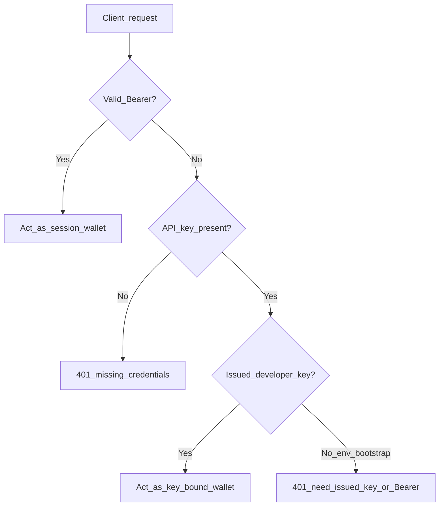
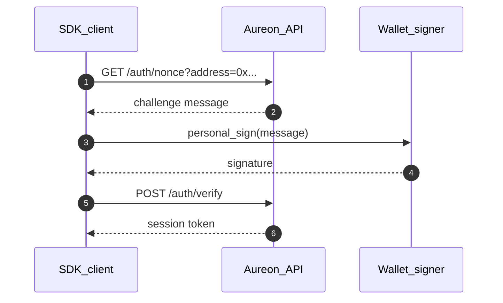

# Authentication Guide

How `@buildaureon/sdk` authenticates to the hosted AUREON API for agents, scripts, and server integrations.

**Automation note:** The SDK path is designed for **Automatic** objectives only (`automationMode: "auto"`). Manual operator Approve flows belong in the utility UI, not in SDK agent loops.

---

## 1. Authentication topology



| Credential | Header | Role |
| --- | --- | --- |
| **Issued API key** (Developers console) | `X-Aureon-Api-Key` | Product access **and** wallet identity for control-plane calls |
| **Env bootstrap key** (`AUREON_API_KEYS` on server) | `X-Aureon-Api-Key` | Product gate only — does **not** identify a wallet |
| **Wallet Bearer** | `Authorization: Bearer …` | Optional session identity. **Wins** when both Bearer and key are present |
| **Private key** | (chain only) | Sign/broadcast deposit & withdraw txs — never sent to the API |

Control-plane calls (sync, objectives, health, restore, vault reads, prepare-*) need an **issued** developer key **or** a Bearer session. Moving capital on-chain always needs a local signer.

---

## 2. Recommended path: issued API key

1. Open the operator utility → **Developers**.
2. Create a key. Copy the plaintext once.
3. Set env and construct the client:

```ts
import { createAureonClient } from "@buildaureon/sdk";

const aureon = createAureonClient({
  baseUrl: "https://api.aureonlabs.network",
  apiKey: process.env.AUREON_API_KEY!, // issued key from Developers
});

const me = await aureon.me();
console.log("wallet", me.walletAddress);

const vault = await aureon.getVaultStatus();
const objectives = await aureon.listObjectives();
```

No Bearer token is required for this path. The gateway resolves the wallet bound to the issued key.

### Deposit / withdraw still need a private key

```ts
const prep = await aureon.prepareVaultDeposit({ symbol: "ETH", amount: "0.1" });
// prep.steps are UNSIGNED — sign and broadcast with viem / ethers / your wallet host
```

The API key can request prepare steps. It cannot sign chain transactions.

---

## 3. Optional Bearer handshake

Use when you intentionally want a wallet session, or when you only have an env bootstrap key (no issued key).



```ts
import { createAureonClient, createSessionTokenProvider } from "@buildaureon/sdk";

const session = createSessionTokenProvider(null);
const aureon = createAureonClient({
  baseUrl: "https://api.aureonlabs.network",
  apiKey: process.env.AUREON_API_KEY,
  getAccessToken: session.getAccessToken,
});

const { message } = await aureon.getAuthNonce(address);
const signature = await wallet.signMessage({ message });
const login = await aureon.verifyWallet({ address, message, signature });
session.setToken(login.token);

await aureon.me();
```

### Challenge message shape

```text
AUREON Login Challenge
Wallet: 0x742d35Cc6634C0532925a3b844Bc454e4438f44e
Nonce: c8a99478fcd9185a494f
Timestamp: 2026-07-15T22:45:00.000Z
Expires: 2026-07-15T22:50:00.000Z

Sign this message to prove ownership of the wallet.
```

### Session provider lifecycle

```ts
session.setToken(login.token); // after verify
await aureon.logout();
session.clear();
```

`createSessionTokenProvider` keeps the client free of global mutable auth state. Prefer `getAccessToken` over a static `authToken` when sessions can rotate.

---

## 4. Precedence and edge cases

| Situation | Result |
| --- | --- |
| Issued key only | Act as key-bound wallet |
| Bearer only | Act as session wallet |
| Bearer + any key | Bearer wins (key validated if sent) |
| Env bootstrap key only | 401 — cannot identify a wallet |
| Invalid / paused / revoked issued key | 401 |
| `devLogin()` | Local preview APIs only — not production |

---

## 5. Environment variables

| Variable | Required | Description |
| --- | --- | --- |
| `AUREON_API_KEY` | Recommended | Issued developer key |
| `AUREON_API_URL` | No | Defaults to `https://api.aureonlabs.network` |
| `AUREON_TOKEN` | No | Optional Bearer for CLI / scripts |

CLI example:

```bash
export AUREON_API_KEY=aureon_....
pnpm --filter @buildaureon/sdk cli me
pnpm --filter @buildaureon/sdk cli sync
pnpm --filter @buildaureon/sdk cli objectives
```

---

## 6. Security rules

- Treat issued keys like passwords: pause, revoke, rotate in Developers.
- Never commit keys or Bearer tokens.
- Never put private keys in SDK env for “convenience.”
- Do not log `Authorization` or `X-Aureon-Api-Key` headers.

---

## 7. Related docs

- [Integration guide](./integration-guide.md)
- [Security](./security.md)
- [Client API](./client-api.md)
- [Error model](./error-model.md)
