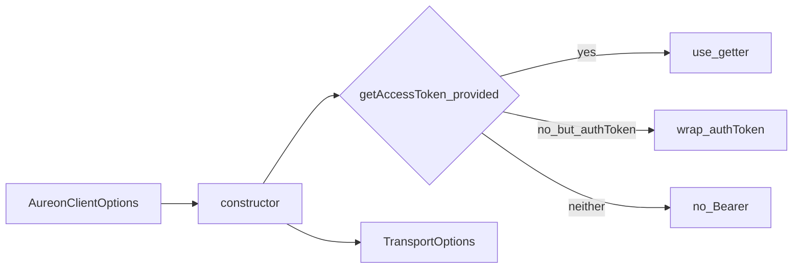
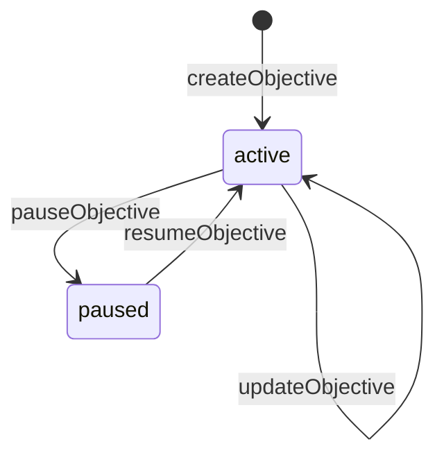
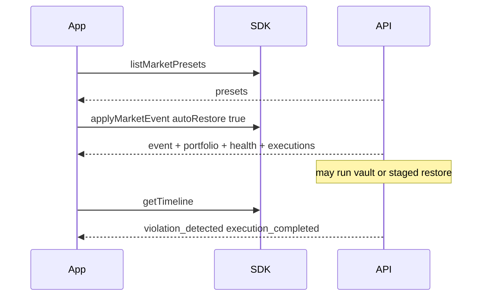

# Client API Reference

Complete reference for every public method on `AureonClient` as implemented in
`src/client/aureon-client.ts`, plus factories and the session helper.

Cross-links: [auth](./auth.md) | [architecture](./architecture.md) | [error-model](./error-model.md) |
[data-contracts](./data-contracts.md) | [transport](./transport.md)

---

## Table of contents

1. [Construction](#1-construction)
2. [Connectivity](#2-connectivity)
3. [Authentication](#3-authentication)
4. [Objectives](#4-objectives)
5. [Health, timeline, portfolio, overview](#5-health-timeline-portfolio-overview)
6. [Vault](#6-vault)
7. [Market and execution](#7-market-and-execution)
8. [Session helper](#8-session-helper)
9. [Method → HTTP cheat sheet](#9-method--http-cheat-sheet)
10. [Common error patterns](#10-common-error-patterns)

---

## 1. Construction

```ts
import {
  createAureonClient,
  AureonClient,
} from "@buildaureon/sdk";

const aureon = createAureonClient({
  // baseUrl defaults to https://api.aureonlabs.network
  apiKey: process.env.AUREON_API_KEY,
  getAccessToken: () => sessionToken,
  timeoutMs: 30_000,
  maxRetries: 2,
});
```

### Options reference

| Option | Required | Default | Description |
|--------|----------|---------|-------------|
| `baseUrl` | no | `https://api.aureonlabs.network` | Absolute `http://` or `https://` URL. |
| `apiKey` | SDK / CLI | N/A | Sent as `X-Aureon-Api-Key`. Issued developer keys also identify the bound wallet (no Bearer required). Env bootstrap keys are product-gate only. Utility uses wallet Bearer only. |
| `getAccessToken` | no | N/A | Optional Bearer getter. Wins over API-key identity when present. |
| `authToken` | no | N/A | Static Bearer string when `getAccessToken` is omitted. |
| `timeoutMs` | no | `30000` | Per-attempt abort timeout. |
| `maxRetries` | no | `0` | Extra attempts after first failure for retryable errors. |
| `retryDelayMs` | no | `250` | Fixed delay between retries. |
| `logger` | no | N/A | `AureonLogger`. |
| `headers` | no | `{}` | Merged into every request. |
| `fetch` | no | `globalThis.fetch` | Custom fetch for unusual runtimes. |

### Construction rules

| Rule | Behavior |
|------|----------|
| Omitted `baseUrl` | Uses production default |
| Invalid `baseUrl` scheme | Throws via `assertBaseUrl` |
| Both `authToken` and `getAccessToken` | Transport uses `getAccessToken` only |
| `aureon.baseUrl` getter | Returns resolved base (no trailing slash) |



---

## 2. Connectivity

### `ping()`

```ts
async ping(): Promise<{ ok: true; service: string; version: string }>
```

| | |
|--|--|
| Auth | No |
| HTTP | `GET /healthz` |
| Use | Boot checks, CLI smoke, CI health gate |
| Errors | `NETWORK_ERROR`, `TIMEOUT`, `SERVER_ERROR` |

```ts
const { ok, service, version } = await aureon.ping();
// { ok: true, service: "aureon-backend", version: "0.2.0" }
```

---

## 3. Authentication

Deep narrative: [auth.md](./auth.md). Method cards below.

### `getAuthNonce(address)`

```ts
async getAuthNonce(address: string): Promise<AuthNonceResponse>
// AuthNonceResponse: { walletAddress, nonce, message, expiresAt }
```

| | |
|--|--|
| Auth | No |
| HTTP | `GET /auth/nonce?address=<encoded>` |
| Client validation | Empty/whitespace address → `VALIDATION_ERROR` |
| Notes | Sign the returned `message` **exactly**. Do not build your own challenge. |

### `verifyWallet({ address, message, signature })`

```ts
async verifyWallet(input: {
  address: string;
  message: string;
  signature: string;
}): Promise<AuthSessionResponse>
// { token, walletAddress, expiresAt, sessionId, mode? }
```

| | |
|--|--|
| Auth | No (establishes auth) |
| HTTP | `POST /auth/verify` |
| Client validation | All three fields required after trim |
| Host duty | Store `token`; feed via `getAccessToken` |

### `devLogin()`

```ts
async devLogin(): Promise<AuthSessionResponse>
```

| | |
|--|--|
| Auth | No |
| HTTP | `POST /auth/dev-login` |
| Backend gate | `AUREON_ALLOW_DEV_LOGIN=1` |
| Typical failure | Forbidden / unauthorized when flag off |
| Notes | May include `mode: "dev-bypass"`. Never ship as sole product login. |

### `logout()`

```ts
async logout(): Promise<{ ok: true }>
```

| | |
|--|--|
| Auth | Bearer recommended |
| HTTP | `POST /auth/logout` |
| Host duty | Also `session.clear()` / stop returning token |

### `me()`

```ts
async me(): Promise<AuthMeResponse>
// { walletAddress: string }
```

| | |
|--|--|
| Auth | **Required** |
| HTTP | `GET /auth/me` |
| Use | Session probe after hydrate |
| Errors | `UNAUTHORIZED` when token missing/invalid |

---

## 4. Objectives

### Objective kinds and priorities

| `ObjectiveKind` | Intent |
|-----------------|--------|
| `stable_allocation` | Hold a target stable weight (e.g. 20% USDG) |
| `balanced_portfolio` | Hold balanced sleeve near a target weight |
| `risk_ceiling` | Keep risk at or below configured ceiling |
| `reward_reinvestment` | Reinvest rewards toward a target sleeve |

| `ObjectivePriority` | Notes |
|---------------------|-------|
| `low` / `medium` / `high` / `critical` | Influences evaluation ordering when multiple objectives compete. Create defaults to `high`. |

### `createObjective(input)`

```ts
async createObjective(input: CreateObjectiveInput): Promise<Objective>
```

| | |
|--|--|
| Auth | Required |
| HTTP | `POST /objectives` |
| Client validation | Name ≥ 3 chars; kind; `targetWeight` ∈ [0,1]; `tolerance` ∈ [0,0.5]; priority if set |
| Automation | SDK supports **Automatic only**. Defaults **`automationMode: "auto"`**. Omit the field in agent integrations. |
| `targetSymbol` | Required when `kind === "balanced_portfolio"` (uppercased on normalize). |

**SDK policy:** Automatic mode only. Manual Approve belongs in the operator utility — do not build Manual agent loops with this package.

```ts
const objective = await aureon.createObjective({
  name: "Maintain 20% Stable Assets",
  kind: "stable_allocation",
  targetWeight: 0.2,
  tolerance: 0.02,
  priority: "high",
  // automationMode omitted → Automatic
});

const balanced = await aureon.createObjective({
  name: "Hold 30% NVDA sleeve",
  kind: "balanced_portfolio",
  targetSymbol: "NVDA",
  targetWeight: 0.3,
  tolerance: 0.05,
});
```

### `listObjectives()`

```ts
async listObjectives(): Promise<Objective[]>
```

| | |
|--|--|
| Auth | Required |
| HTTP | `GET /objectives` |
| Unwrap | `{ objectives: Objective[] }` → array |

### `getObjective(id)`

```ts
async getObjective(id: string): Promise<Objective>
```

| | |
|--|--|
| Auth | Required |
| HTTP | `GET /objectives/:id` |
| Client validation | Id must be a non-trivial string (`assertId`) |
| Errors | `NOT_FOUND`, `VALIDATION_ERROR` |

### `updateObjective(id, input)`

```ts
async updateObjective(id: string, input: UpdateObjectiveInput): Promise<Objective>
```

| | |
|--|--|
| Auth | Required |
| HTTP | `PATCH /objectives/:id` |
| Body | Partial: name, priority, targetWeight, tolerance, maxRiskScore, reinvestRatio |
| Locked at create | `targetSymbol`, `automationMode` — recreate the objective to change either |

### `pauseObjective(id)` / `resumeObjective(id)`

```ts
async pauseObjective(id: string): Promise<Objective>
async resumeObjective(id: string): Promise<Objective>
```

| | |
|--|--|
| Auth | Required |
| HTTP | `POST /objectives/:id/pause` · `POST /objectives/:id/resume` |
| Effect | Pause stops continuous evaluation; health typically reports `paused` |



---

## 5. Health, timeline, portfolio, overview

### `getHealth(objectiveId?)`

```ts
async getHealth(objectiveId?: string): Promise<ObjectiveHealth[]>
```

| | |
|--|--|
| Auth | Required |
| HTTP | `GET /health` optional `?objectiveId=` |
| Unwrap | `{ health }` |
| States | `healthy` · `warning` · `violation` · `paused` |

### `getTimeline(objectiveId?)`

```ts
async getTimeline(objectiveId?: string): Promise<TimelineEvent[]>
```

| | |
|--|--|
| Auth | Required |
| HTTP | `GET /timeline` optional `?objectiveId=` |
| Unwrap | `{ events }` |
| Use | Operator narrative for launch video / audit |

### `getPortfolio()`

```ts
async getPortfolio(): Promise<PortfolioSnapshot>
```

| | |
|--|--|
| Auth | Required |
| HTTP | `GET /portfolio` |
| Empty book | Valid: `positions.length === 0`, notional may be `0` |

### `clearPortfolio()`

```ts
async clearPortfolio(): Promise<PortfolioSnapshot>
```

| | |
|--|--|
| Auth | Required |
| HTTP | `POST /portfolio/clear` |
| Unwrap | `{ portfolio }` → snapshot |
| Notes | Clears wallet positions. Does **not** seed holdings. |

### `syncPortfolio()`

```ts
async syncPortfolio(): Promise<SyncPortfolioResult>
```

| | |
|--|--|
| Auth | API key + Bearer |
| HTTP | `POST /portfolio/sync` |
| Returns | `{ portfolio, chainId, skippedZero }` |
| Notes | On-chain balances for the session wallet. Vault balances merge into the book. Does **not** invent holdings. |

### `getOverview()`

```ts
async getOverview(): Promise<DashboardOverview>
```

| | |
|--|--|
| Auth | Required |
| HTTP | `GET /overview` |
| Contains | Health counts, global score, 24h portfolio change (daily snapshots), evaluation schedule, recent executions + events |

---

## 6. Vault

Vault reads and prepare endpoints. The API returns calldata **steps**; the host wallet signs and broadcasts, meaning the API never holds user keys.

### `getVault()`

```ts
async getVault(): Promise<VaultOverview>
```

| | |
|--|--|
| Auth | Required |
| HTTP | `GET /vault` |
| Returns | `address`, `chainId`, `tokens`, `balances`, `poolAddress`, `explorerBase`, `keeperAddress` |

### `getVaultStatus()`

```ts
async getVaultStatus(): Promise<VaultStatus>
// { empty, totalNotionalUsd, canRestore }
```

| | |
|--|--|
| Auth | Required |
| HTTP | `GET /vault/status` |
| Use | Compact funding signal before restore |

### `prepareVaultDeposit({ symbol, amount })`

```ts
async prepareVaultDeposit(input: {
  symbol: string; // "ETH" or any allowlisted ERC-20 (WETH, stables, …)
  amount: string;
}): Promise<VaultPrepareResult>
```

| | |
|--|--|
| Auth | Required |
| HTTP | `POST /vault/prepare-deposit` body `{ symbol, amount }` |
| ETH | Steps include `depositETH` (native value on step → vault WETH) |
| ERC-20 | Steps include `approve` then `deposit` for any allowlisted symbol |
| Host duty | Sign `steps` in order on `chainId`; broadcast each tx |

### `prepareVaultWithdraw({ symbol?, amount })`

```ts
async prepareVaultWithdraw(input: {
  symbol?: string;  // default "WETH"; any vault ERC-20 held by the user
  amount: string;
}): Promise<VaultPrepareResult>
```

| | |
|--|--|
| Auth | Required |
| HTTP | `POST /vault/prepare-withdraw` body `{ symbol, amount }` |
| Symbol | Any allowlisted vault ERC-20 (not native ETH, use WETH) |
| Host duty | Sign and broadcast returned `steps` |

---

## 7. Market and execution

### Launch / rehearsal flow



### `listMarketPresets()`

```ts
async listMarketPresets(): Promise<MarketPreset[]>
```

| | |
|--|--|
| Auth | Required |
| HTTP | `GET /market/presets` |
| Unwrap | `{ presets }` |
| Fields | `name`, `description`, `symbol`, `priceChangeRatio` |

### `applyMarketEvent(input)`

```ts
async applyMarketEvent(input: ApplyMarketEventInput): Promise<{
  event: MarketEvent;
  portfolio: PortfolioSnapshot;
  health: ObjectiveHealth[];
  executions: ExecutionReceipt[];
}>
```

| | |
|--|--|
| Auth | Required |
| HTTP | `POST /market/events` |
| Normalization | Uppercases symbol; `autoRestore` defaults **true** |
| Validation | Symbol required; finite `priceChangeRatio`; rejects extreme ≤ -0.95 |

### `getRestorePlan(objectiveId)`

```ts
async getRestorePlan(objectiveId: string): Promise<RestorePlan>
// { kind, amountHuman, approxUsd, message, sellSymbol?, buySymbol? }
```

| | |
|--|--|
| Auth | Required |
| HTTP | `GET /objectives/:id/restore-plan` |
| Kinds | `wrap_eth` · `unwrap_weth` · `vault_swap` |
| Use | Inspect plan before acting, noting that wrap/unwrap is client-side |

### `runExecution(objectiveId)`

```ts
async runExecution(objectiveId: string): Promise<ExecutionReceipt>
```

| | |
|--|--|
| Auth | Required |
| HTTP | `POST /executions/run` body `{ objectiveId }` |
| Settlement | Receipt may include `settlement: "vault"` or `"staged"` |
| Use | Restore when plan kind is `vault_swap` (rejects wrap/unwrap with action details) |

### `restoreObjective(objectiveId)`

```ts
async restoreObjective(objectiveId: string): Promise<ExecutionReceipt>
```

| | |
|--|--|
| Auth | Required |
| HTTP | `POST /objectives/:id/restore` |
| Settlement | Vault-backed restore when configured; same honesty labels as `runExecution` |
| Use | Preferred vault restore entry for Automatic objectives after breach |

### `listExecutions(objectiveId?)`

```ts
async listExecutions(objectiveId?: string): Promise<ExecutionReceipt[]>
```

| | |
|--|--|
| Auth | Required |
| HTTP | `GET /executions` optional `?objectiveId=` |
| Unwrap | `{ executions }` |

---

## 8. Session helper

```ts
import { createSessionTokenProvider } from "@buildaureon/sdk";

const session = createSessionTokenProvider(initialToken?: string | null);
session.getAccessToken(); // () => string | null
session.setToken(token);
session.clear();
```

| Method | Purpose |
|--------|---------|
| `getAccessToken` | Pass directly into `createAureonClient({ getAccessToken })` |
| `setToken` | After `verifyWallet` / `devLogin` |
| `clear` | After `logout` or local sign-out |

---

## 9. Method → HTTP cheat sheet

| Method | Verb | Path | Auth |
|--------|------|------|------|
| `ping` | GET | `/healthz` | no |
| `getAuthNonce` | GET | `/auth/nonce` | no |
| `verifyWallet` | POST | `/auth/verify` | no |
| `devLogin` | POST | `/auth/dev-login` | no |
| `logout` | POST | `/auth/logout` | recommended |
| `me` | GET | `/auth/me` | **yes** |
| `createObjective` | POST | `/objectives` | **yes** |
| `listObjectives` | GET | `/objectives` | **yes** |
| `getObjective` | GET | `/objectives/:id` | **yes** |
| `updateObjective` | PATCH | `/objectives/:id` | **yes** |
| `pauseObjective` | POST | `/objectives/:id/pause` | **yes** |
| `resumeObjective` | POST | `/objectives/:id/resume` | **yes** |
| `getHealth` | GET | `/health` | **yes** |
| `getTimeline` | GET | `/timeline` | **yes** |
| `getPortfolio` | GET | `/portfolio` | **yes** |
| `setPortfolio` | PUT | `/portfolio` | **yes** |
| `clearPortfolio` | POST | `/portfolio/clear` | **yes** |
| `syncPortfolio` | POST | `/portfolio/sync` | **yes** |
| `refreshWatchdog` | POST | `/watchdog/refresh` | **yes** |
| `getOverview` | GET | `/overview` | **yes** |
| `listMarketPresets` | GET | `/market/presets` | **yes** |
| `applyMarketEvent` | POST | `/market/events` | **yes** |
| `getRestorePlan` | GET | `/objectives/:id/restore-plan` | **yes** |
| `restoreObjective` | POST | `/objectives/:id/restore` | **yes** |
| `runExecution` | POST | `/executions/run` | **yes** |
| `listExecutions` | GET | `/executions` | **yes** |
| `getVault` | GET | `/vault` | **yes** |
| `getVaultStatus` | GET | `/vault/status` | **yes** |
| `prepareVaultDeposit` | POST | `/vault/prepare-deposit` | **yes** |
| `prepareVaultWithdraw` | POST | `/vault/prepare-withdraw` | **yes** |

---

## 10. Common error patterns

| Situation | Typical `code` | Integrator action |
|-----------|----------------|-------------------|
| Forgot Bearer on protected route | `UNAUTHORIZED` | Re-login / fix `getAccessToken` |
| Name too short on create | `VALIDATION_ERROR` | Fix form |
| Unknown objective id | `NOT_FOUND` | Refresh list |
| Backend restart mid-session | `UNAUTHORIZED` | Clear token, connect again |
| Transient 503 | `SERVER_ERROR` | Retries if `maxRetries > 0` |
| Offline | `NETWORK_ERROR` | Show connectivity banner |

Full matrix: [error-model.md](./error-model.md).
