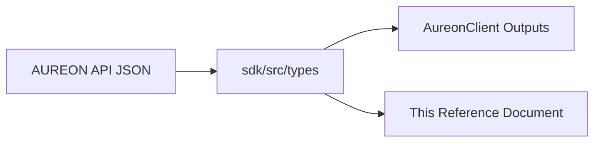

# Data Contracts Reference

This document defines the field-level data contracts used across `@buildaureon/sdk`. These structures are exported directly from `src/types/*` and match the JSON schemas returned by the hosted AUREON API.

Cross-links: [Client API Reference](./client-api.md) | [Architecture Guide](./architecture.md) | [Authentication Guide](./auth.md) | [Integration Guide](./integration-guide.md)

---

## 1. Document Overview

Every domain model in the AUREON system has a corresponding TypeScript type and representation in our public API. 



This guide details each model, its fields, TypeScript types, constraints, and includes mock JSON examples.

---

## 2. Objective Domain

Objectives represent the core primitives of AUREON. Instead of executing one-off transactions, operators register continuous rules (e.g., "Maintain a 20% stablecoin reserve").

### ObjectiveStatus

Describes the lifecycle state of a registered financial compass objective:

*   `draft`: The objective is created but not active in background evaluation loops.
*   `validated`: The objective has passed initial syntax and balance sanity checks.
*   `active`: The objective is being actively checked by the live-mark watchdog engine.
*   `paused`: Evaluation is suspended. No automated alerts or restores will trigger.
*   `cancelled`: The objective is terminated permanently. It cannot be reactivated.
*   `completed`: The objective successfully achieved its policy goals and is now archived.

```ts
export type ObjectiveStatus = "draft" | "validated" | "active" | "paused" | "cancelled" | "completed";
```

### ObjectiveKind

Defines the rule or mathematical formula governing the objective:

*   `stable_allocation`: Monitors stablecoin assets to keep them at a specific proportion of the total portfolio value.
*   `balanced_portfolio`: Rebalances multiple assets to keep them near defined target weights relative to each other.
*   `risk_ceiling`: Monitors the volatility or risk score of portfolio assets, alerting or rebalancing if it crosses a configured limit.
*   `reward_reinvestment`: Automatically redirects yield, rewards, or idle gas tokens back into designated asset sleeves.

```ts
export type ObjectiveKind = "stable_allocation" | "balanced_portfolio" | "risk_ceiling" | "reward_reinvestment";
```

### ObjectivePriority

Prioritizes resource allocation and execution order when multiple rules compete for liquidity or gas limits:
`low` · `medium` · `high` · `critical` (default is `high`).

```ts
export type ObjectivePriority = "low" | "medium" | "high" | "critical";
```

### ObjectiveAutomationMode

Determines how policy violations are corrected:

* `auto` — Automatic restore coordination (SDK **only** supported mode; default).
* `manual` — Operator utility Approve flow. Not used for SDK agent integrations.

```ts
export type ObjectiveAutomationMode = "manual" | "auto";
```

For `@buildaureon/sdk`, always omit `automationMode` or pass `"auto"`.

### ObjectivePolicy

Specifies the mathematical parameters governing target bounds:

```ts
export interface ObjectivePolicy {
  /** Target weight fraction between 0.0 and 1.0 (e.g., 0.25 represents 25%) */
  targetWeight: number;
  /** Allowed deviation tolerance (e.g., 0.05 represents +-5% deviation window) */
  tolerance: number;
  /** Optional risk ceiling score when kind is risk_ceiling */
  maxRiskScore?: number;
  /** Optional fraction of rewards to redirect when kind is reward_reinvestment */
  reinvestRatio?: number;
  /** Holding symbol when tracking a specific asset (e.g., "WETH") */
  targetSymbol?: string;
  /** Automatically generated human-readable policy summary */
  summary: string;
}
```

### Objective

The main database record returned by objective endpoints:

```ts
export interface Objective {
  id: string;
  name: string;
  kind: ObjectiveKind;
  status: ObjectiveStatus;
  priority: ObjectivePriority;
  automationMode: ObjectiveAutomationMode;
  policy: ObjectivePolicy;
  ownerId: string;
  createdAt: string;
  updatedAt: string;
  lastEvaluatedAt: string | null;
  lastExecutionId: string | null;
}
```

#### JSON Representation Example
```json
{
  "id": "obj_01h8v12x8p8p3z2v1q45r3m2e1",
  "name": "USDG Buffer Protection",
  "kind": "stable_allocation",
  "status": "active",
  "priority": "high",
  "automationMode": "auto",
  "policy": {
    "targetWeight": 0.2,
    "tolerance": 0.02,
    "summary": "Maintain 20.0% stable allocation within ±2.0%"
  },
  "ownerId": "0x742d35Cc6634C0532925a3b844Bc454e4438f44e",
  "createdAt": "2026-07-15T12:00:00.000Z",
  "updatedAt": "2026-07-15T12:30:00.000Z",
  "lastEvaluatedAt": "2026-07-15T22:45:00.000Z",
  "lastExecutionId": "exec_01h8v5t7p8p3z2v1q45r3m2e99"
}
```

### Inputs

#### `CreateObjectiveInput`
Passed to `createObjective` to register a new rule:
*   `name` (Required): String, minimum length of 3 characters.
*   `kind` (Required): Supported kind enum.
*   `targetWeight` (Required): Number between 0.0 and 1.0.
*   `tolerance` (Required): Number between 0.0 and 0.5.
*   `priority` (Optional): Defaults to `high`.
*   `targetSymbol` (Required if kind is `balanced_portfolio`): Token symbol.
*   `automationMode` (Optional): Defaults to `auto` in the SDK.

#### `UpdateObjectiveInput`
Passed to `updateObjective` for partial updates. `targetSymbol` and `automationMode` are fixed at creation and cannot be updated.

```ts
export interface UpdateObjectiveInput {
  name?: string;
  priority?: ObjectivePriority;
  targetWeight?: number;
  tolerance?: number;
  maxRiskScore?: number;
  reinvestRatio?: number;
  targetSymbol?: never; // Disallowed on updates
  automationMode?: never; // Disallowed on updates
}
```

---

## 3. Portfolio Domain

Tracks the capital distribution of an authenticated wallet address. Portfolios are divided into asset sleeves (e.g., stablecoins, stocks, gas).

### PortfolioPosition

Represents a single asset holding:

```ts
export interface PortfolioPosition {
  id: string;
  symbol: string;
  name: string;
  category: "stable" | "stock_token" | "gas" | "other";
  quantity: number;
  markPriceUsd: number;
  notionalUsd: number;
  weight: number;
  updatedAt: string;
}
```

### PortfolioSnapshot

An immutable snapshot of the total wallet allocation:

```ts
export interface PortfolioSnapshot {
  portfolioId: string;
  totalNotionalUsd: number;
  stableWeight: number;
  stockTokenWeight: number;
  gasWeight: number;
  positions: PortfolioPosition[];
  asOf: string;
}
```

#### JSON Representation Example
```json
{
  "portfolioId": "0x742d35Cc6634C0532925a3b844Bc454e4438f44e",
  "totalNotionalUsd": 50000.0,
  "stableWeight": 0.205,
  "stockTokenWeight": 0.702,
  "gasWeight": 0.093,
  "positions": [
    {
      "id": "pos_usdg",
      "symbol": "USDG",
      "name": "Aureon Stable Dollar",
      "category": "stable",
      "quantity": 10250,
      "markPriceUsd": 1.0,
      "notionalUsd": 10250.0,
      "weight": 0.205,
      "updatedAt": "2026-07-15T22:45:00.000Z"
    },
    {
      "id": "pos_weth",
      "symbol": "WETH",
      "name": "Wrapped Ether",
      "category": "gas",
      "quantity": 2.5,
      "markPriceUsd": 1860.0,
      "notionalUsd": 4650.0,
      "weight": 0.093,
      "updatedAt": "2026-07-15T22:45:00.000Z"
    }
  ],
  "asOf": "2026-07-15T22:45:00.000Z"
}
```

---

## 4. Health Domain

Evaluates how closely the actual portfolio balances match the active objective policies.

### HealthState

Indicates the deviation status:
*   `healthy`: The deviation is within the configured tolerance bounds.
*   `warning`: The deviation is approaching a breach, requiring monitoring.
*   `violation`: The deviation has exceeded tolerance bounds, triggering restore plan execution.
*   `paused`: The objective is paused and is excluded from monitoring status.

```ts
export type HealthState = "healthy" | "warning" | "violation" | "paused";
```

### ObjectiveHealth

Structured health metrics for a single objective:

```ts
export interface ObjectiveHealth {
  objectiveId: string;
  state: HealthState;
  score: number;
  currentMetric: number;
  targetMetric: number;
  deviation: number;
  message: string;
  evaluatedAt: string;
}
```

#### JSON Representation Example
```json
{
  "objectiveId": "obj_01h8v12x8p8p3z2v1q45r3m2e1",
  "state": "violation",
  "score": 45.0,
  "currentMetric": 0.125,
  "targetMetric": 0.20,
  "deviation": -0.075,
  "message": "Stable allocation at 12.5% (Target: 20.0% +- 2.0%)",
  "evaluatedAt": "2026-07-15T22:45:00.000Z"
}
```

---

## 5. Timeline Domain

An append-only audit trail logging major system actions and states.

### TimelineEventType

Standardized event categories:
*   `objective_created` or `objective_updated`: Configuration additions and changes.
*   `objective_paused` or `objective_resumed`: State lifecycle modifications.
*   `health_changed` or `violation_detected` or `objective_restored`: State transition checks.
*   `evaluation_started`: Heartbeat watchdog runs.
*   `execution_started` or `execution_completed`: Rebalance execution tracking.
*   `market_event_applied`: Controlled mock changes for system testing.
*   `capital_provisioned` or `capital_synced` or `capital_cleared`: Portfolio ledger events.

```ts
export type TimelineEventType =
  | "objective_created"
  | "objective_updated"
  | "objective_paused"
  | "objective_resumed"
  | "health_changed"
  | "violation_detected"
  | "evaluation_started"
  | "execution_started"
  | "execution_completed"
  | "market_event_applied"
  | "objective_restored"
  | "capital_provisioned"
  | "capital_cleared"
  | "capital_synced";
```

### TimelineEvent

An audit event:

```ts
export interface TimelineEvent {
  id: string;
  objectiveId: string | null;
  type: TimelineEventType;
  message: string;
  payload: Record<string, unknown>;
  createdAt: string;
}
```

#### JSON Representation Example
```json
{
  "id": "evt_01h8v6x7p8p3z2v1q45r3m2e11",
  "objectiveId": "obj_01h8v12x8p8p3z2v1q45r3m2e1",
  "type": "violation_detected",
  "message": "Objective USDG Buffer Protection is in violation: Stable allocation fell below tolerance limit",
  "payload": {
    "currentStableWeight": 0.125,
    "targetStableWeight": 0.20,
    "tolerance": 0.02
  },
  "createdAt": "2026-07-15T22:45:01.000Z"
}
```

---

## 6. Execution Domain

Defines the steps and receipts involved in restoring an objective back to policy compliance.

### RestorePlanKind

*   `wrap_eth`: Converts native ETH to Wrapped Ether (WETH) on the host wallet. This is client-side.
*   `unwrap_weth`: Converts WETH back to ETH on the host wallet. This is client-side.
*   `vault_swap`: Conducts an on-chain rebalancing swap within the smart vault via Hono API/keepers.

```ts
export type RestorePlanKind = "wrap_eth" | "unwrap_weth" | "vault_swap";
```

### RestorePlan

```ts
export interface RestorePlan {
  kind: RestorePlanKind;
  amountHuman: string;
  approxUsd: number;
  message: string;
  sellSymbol?: string;
  buySymbol?: string;
}
```

### ExecutionReceipt

The logged result of a run execution:

```ts
export interface ExecutionReceipt {
  id: string;
  objectiveId: string;
  status: "pending" | "submitted" | "confirmed" | "failed";
  transactionHash: string;
  action: string;
  notionalAdjustedUsd: number;
  result: string;
  createdAt: string;
  confirmedAt: string | null;
  /** 
   * vault represents keeper rebalances on the Robinhood Chain.
   * staged represents simulated/book-only ledger updates.
   */
  settlement?: "staged" | "vault";
}
```

#### JSON Representation Example
```json
{
  "id": "exec_01h8v5t7p8p3z2v1q45r3m2e99",
  "objectiveId": "obj_01h8v12x8p8p3z2v1q45r3m2e1",
  "status": "confirmed",
  "transactionHash": "0xe295c2763f0d4681a8b54dfd38a0f8bfd21051515fcd9185a494ff3c8a99478f",
  "action": "Restore stablecoin sleeve: Swap stock tokens for USDG",
  "notionalAdjustedUsd": 3750.0,
  "result": "Exchanged stock tokens for 3750.0 USDG on Robinhood Chain",
  "createdAt": "2026-07-15T22:46:00.000Z",
  "confirmedAt": "2026-07-15T22:46:05.000Z",
  "settlement": "vault"
}
```

---

## 7. Vault Domain

AUREON operates non-custodial Smart Vaults on the Robinhood Chain. Users interact with vault balances by preparing transaction calldata via the API, then signing and broadcasting locally.

### VaultToken

```ts
export interface VaultToken {
  symbol: string;
  name: string;
  address: string;
  decimals: number;
  category?: string;
}
```

### VaultBalance

```ts
export interface VaultBalance {
  symbol: string;
  name: string;
  token: string;
  decimals: number;
  category?: string;
  raw: string;
  quantity: number;
  markPriceUsd: number | null;
  notionalUsd: number | null;
}
```

### VaultOverview

```ts
export interface VaultOverview {
  address: string;
  chainId: number;
  tokens: VaultToken[];
  balances: VaultBalance[];
  poolAddress: string | null;
  explorerBase: string;
  keeperAddress: string | null;
}
```

### VaultPreparedStep

An individual calldata instruction:

```ts
export interface VaultPreparedStep {
  to: string;
  data: string;
  value: string;
  functionName: "approve" | "deposit" | "depositETH" | "withdraw";
  label: string;
}
```

### VaultPrepareResult

The aggregated calldata bundle returned by the API:

```ts
export interface VaultPrepareResult {
  chainId: number;
  vaultAddress: string;
  explorerBase: string;
  symbol: string;
  amountRaw: string;
  amountHuman: string;
  steps: VaultPreparedStep[];
}
```

#### JSON Representation Example
```json
{
  "chainId": 46630,
  "vaultAddress": "0x1234567890123456789012345678901234567890",
  "explorerBase": "https://explorer.robinhoodnet.org",
  "symbol": "WETH",
  "amountRaw": "1000000000000000000",
  "amountHuman": "1.0",
  "steps": [
    {
      "to": "0xc02aaa39b223fe8d0a0e5c4f27ead9083c756cc2",
      "data": "0x095cae9a0000000000000000000000001234567890123456789012345678901234567890ffffffffffffffffffffffffffffffffffffffffffffffffffffffffffffffff",
      "value": "0",
      "functionName": "approve",
      "label": "Approve WETH allowance for Vault"
    },
    {
      "to": "0x1234567890123456789012345678901234567890",
      "data": "0xb6b55f250000000000000000000000000000000000000000000000000de0b6b3a7640000",
      "value": "0",
      "functionName": "deposit",
      "label": "Deposit 1.0 WETH into Vault"
    }
  ]
}
```

---

## 8. Market Domain

Supports simulation and pricing variables for testing rebalances.

### MarketEvent

```ts
export interface MarketEvent {
  id: string;
  name: string;
  description: string;
  symbol: string;
  priceChangeRatio: number;
  appliedAt: string;
}
```

### ApplyMarketEventInput

```ts
export interface ApplyMarketEventInput {
  name?: string;
  description?: string;
  symbol: string;
  priceChangeRatio: number;
  autoRestore?: boolean;
}
```

---

## 9. Dashboard Overview

Provides a high-level summary of all objectives, health states, historical scores, and execution events.

### DashboardOverview

```ts
export interface DashboardOverview {
  activeObjectives: number;
  healthyCount: number;
  warningCount: number;
  violationCount: number;
  pausedCount: number;
  totalNotionalUsd: number;
  stableWeight: number;
  assetCount: number;
  change24hUsd: number | null;
  change24hPct: number | null;
  change24hBaselineOnly: boolean;
  change24hHasSnapshot: boolean;
  globalHealthScore: number | null;
  healthHistory: Array<{ at: string; score: number }>;
  attentionCount: number;
  lastEvaluationAt: string | null;
  nextEvaluationAt: string | null;
  watchdogIntervalMs: number | null;
  lastWatchdogError: string | null;
  lastSyncedAt: string | null;
  recentExecutions: ExecutionReceipt[];
  recentEvents: TimelineEvent[];
}
```

---

## 10. Client Options (Config Contract)

Configuration block supplied to the `AureonClient` constructor.

```ts
export interface AureonClientOptions {
  baseUrl?: string;
  apiKey?: string | null;
  getApiKey?: () => string | null | undefined | Promise<string | null | undefined>;
  fetch?: typeof fetch;
  headers?: Record<string, string>;
  timeoutMs?: number;
  authToken?: string | null;
  getAccessToken?: () => string | null | undefined | Promise<string | null | undefined>;
  logger?: AureonLogger;
  maxRetries?: number;
  retryDelayMs?: number;
}
```

---

## 11. Invariants Checklist

*   `targetWeight` must be inside the `[0, 1]` closed interval.
*   `tolerance` must be inside the `[0, 0.5]` closed interval.
*   Objective display names must have a trimmed length of at least 3 characters.
*   `balanced_portfolio` objectives must specify a valid targetSymbol string.
*   SDK client creations default to Automatic restore mode (`automationMode: "auto"`).
*   Any base URL passed must use an absolute `http://` or `https://` scheme.
*   The portfolio book may be empty, which is evaluated as 0 notional value.
*   Execution receipts must label the settlement mechanism cleanly (`staged` versus `vault`).
*   Vault preparation endpoints only produce unsigned calldata, keeping private signing operations strictly local.
