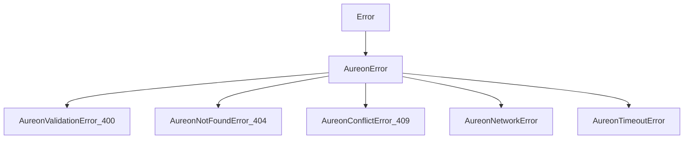
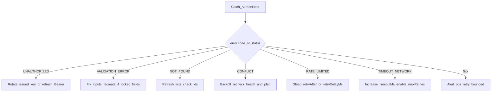

# Error Model and Diagnostics

Error classification, payloads, recovery patterns, and live failure modes for `@buildaureon/sdk`.

**Automation note:** Examples assume **Automatic** objectives. Manual Approve error paths are out of scope for SDK agents.

---

## 1. Exception hierarchy

All SDK failures that represent API/client faults extend `AureonError`.



### Properties

| Field | Meaning |
| --- | --- |
| `code` | Stable string for branching (`UNAUTHORIZED`, `VALIDATION_ERROR`, …) |
| `status` | HTTP status, or `null` for pure network failures |
| `details` | Optional structured metadata from the API |
| `retryable` | Whether an immediate retry is reasonable |
| `message` | Human-readable summary |

```ts
import { isAureonError } from "@buildaureon/sdk";

try {
  await aureon.restoreObjective(id);
} catch (err) {
  if (isAureonError(err)) {
    console.error(err.code, err.status, err.details);
  }
  throw err;
}
```

---

## 2. Common API payloads

### Validation (400)

```json
{
  "code": "VALIDATION_ERROR",
  "message": "Create objective parameters failed validation",
  "details": {
    "targetWeight": "must be between 0 and 1",
    "tolerance": "must be between 0 and 0.5"
  }
}
```

Also covers locked-field updates (e.g. attempting to change `targetSymbol` / `automationMode` after create).

### Unauthorized (401)

```json
{
  "message": "Invalid API key",
  "details": null
}
```

Or, when an env bootstrap key is used without wallet identity:

```json
{
  "message": "Wallet session required (env API keys cannot identify a wallet; use an issued developer key or Bearer)",
  "details": null
}
```

### Not found (404)

Missing objective / key id / resource.

### Conflict (409)

```json
{
  "code": "CONFLICT",
  "message": "Cannot modify objective while restore is in flight",
  "details": {
    "objectiveId": "obj_...",
    "status": "pending_confirmation"
  }
}
```

Also appears when restore is rejected because capital / plan / vault state conflicts with the request.

### Rate limit (429)

```json
{
  "code": "RATE_LIMITED",
  "message": "Too many requests",
  "details": { "retryAfterSeconds": 15 }
}
```

### Server (5xx)

Retryable when `maxRetries` > 0. Alert ops if persistent.

---

## 3. Operational recovery map



| Situation | Agent action |
| --- | --- |
| Invalid / paused key | Stop loop; operator rotates Developers key |
| Bootstrap key alone | Switch to issued key |
| Vault empty on restore | Prepare deposit → broadcast → sync → retry |
| Locked field on update | Recreate objective |
| Conflict mid-restore | Back off; read timeline / executions |
| Staged settlement returned | Do not treat as on-chain success |

---

## 4. Logging hooks

```ts
import { createAureonClient } from "@buildaureon/sdk";

const aureon = createAureonClient({
  apiKey: process.env.AUREON_API_KEY!,
  logger: {
    debug: (msg, ctx) => console.debug(msg, ctx),
    info: (msg, ctx) => console.info(msg, ctx),
    warn: (msg, ctx) => console.warn(msg, ctx),
    error: (msg, ctx) => {
      // forward to your APM — never include secrets from ctx
      console.error(msg, ctx);
    },
  },
});
```

---

## 5. Client-side validation vs server errors

The SDK normalizes create/update inputs before HTTP (weights, locked fields, automation defaults). Failures can therefore happen:

1. **Preflight** in the SDK (no network), or
2. **Gateway** after HTTP (allowlists, vault state, conflicts).

Always catch with `isAureonError` and inspect `code` + `details`.

---

## 6. Unit test sketch

```ts
import assert from "node:assert/strict";
import test from "node:test";
import {
  createAureonClient,
  isAureonError,
  AureonValidationError,
} from "@buildaureon/sdk";

test("empty objective name fails validation", async () => {
  const client = createAureonClient({
    baseUrl: "https://api.aureonlabs.network",
    apiKey: "test",
  });

  await assert.rejects(
    () =>
      client.createObjective({
        name: "  ",
        kind: "balanced_portfolio",
        targetWeight: 0.2,
        tolerance: 0.02,
        targetSymbol: "WETH",
      }),
    (err: unknown) =>
      isAureonError(err) &&
      err instanceof AureonValidationError &&
      err.code === "VALIDATION_ERROR"
  );
});
```

---

## 7. Related docs

- [Transport](./transport.md)
- [Auth](./auth.md)
- [Integration guide](./integration-guide.md)
- [Client API](./client-api.md)
