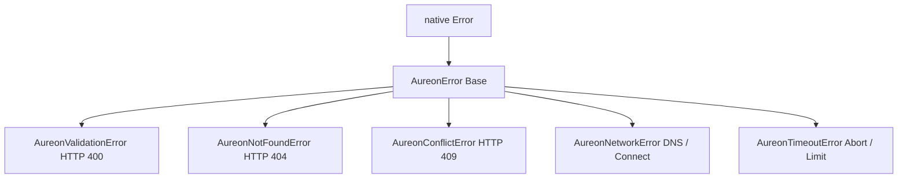
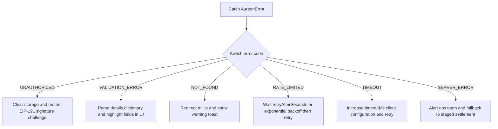

# Detailed Error Model and Diagnostics

This document outlines the error classification system used by `@aureon/sdk`. It provides field specifications, JSON payloads returned by the hosted API, and diagnostic patterns for production environments.

---

## 1. Core Exception Classes

All custom exceptions thrown by the SDK extend the base class `AureonError`. The classes are organized to allow granular catch blocks based on failure categories.



### Property Reference

```ts
export class AureonError extends Error {
  /** Stable error code string. Use this for programmatic branching. */
  readonly code: AureonErrorCode;
  /** HTTP status code from the server, or null for network failures. */
  readonly status: number | null;
  /** Additional key-value metadata returned by the API (e.g. form fields validation). */
  readonly details: Record<string, unknown> | null;
  /** Indicates whether the request can be retried immediately. */
  readonly retryable: boolean;

  constructor(
    message: string,
    code: AureonErrorCode,
    status: number | null = null,
    details: Record<string, unknown> | null = null
  ) {
    super(message);
    this.name = this.constructor.name;
    this.code = code;
    this.status = status;
    this.details = details;
    this.retryable = isRetryableCode(code);

    // Capture stack trace, preserving original V8 exception stack where supported
    if (Error.captureStackTrace) {
      Error.captureStackTrace(this, this.constructor);
    }
  }
}
```

---

## 2. API JSON Error Payload Formats

When an API request fails, the gateway returns a structured JSON payload. The SDK's HTTP transport layer automatically parses this payload and maps it to the appropriate error class.

### 2.1 Validation Error Payload (HTTP 400)
Returned when objective creation weights, names, or tolerances violate system rules.

```json
{
  "code": "VALIDATION_ERROR",
  "message": "Create objective parameters failed validation checks",
  "details": {
    "name": "Objective display name must be at least 3 characters long",
    "targetWeight": "Weight must be a number between 0.0 and 1.0",
    "tolerance": "Tolerance must be a number between 0.0 and 0.5"
  }
}
```

### 2.2 Conflict Error Payload (HTTP 409)
Returned when modifying a resource that is currently locked or undergoing execution.

```json
{
  "code": "CONFLICT",
  "message": "Cannot modify objective state while rebalance swap is processing",
  "details": {
    "objectiveId": "obj_01h8v12x8p8p3z2v1q45r3m2e1",
    "executionId": "exec_01h8v5t7p8p3z2v1q45r3m2e99",
    "status": "pending_confirmation"
  }
}
```

### 2.3 Rate Limit Payload (HTTP 429)
Returned when requests exceed rate limits.

```json
{
  "code": "RATE_LIMITED",
  "message": "Too many requests. Please slow down.",
  "details": {
    "retryAfterSeconds": 15,
    "limit": 100,
    "windowMs": 60000
  }
}
```

---

## 3. Custom Diagnostics and Logging Hooks

Integrators can register a logger interface during client construction to track network requests, retries, and errors in production.

```ts
import { createAureonClient, AureonLogger } from "@aureon/sdk";

const productionLogger: AureonLogger = {
  debug(msg, ctx) { console.debug(`[DEBUG] ${msg}`, ctx || ""); },
  info(msg, ctx) { console.info(`[INFO] ${msg}`, ctx || ""); },
  warn(msg, ctx) { console.warn(`[WARN] ${msg}`, ctx || ""); },
  error(msg, ctx) {
    // Send critical anomalies to third-party alert services
    if (ctx?.code === "SERVER_ERROR" || ctx?.code === "CONFLICT") {
      sendToSentry(msg, ctx);
    }
    console.error(`[ERROR] ${msg}`, ctx || "");
  }
};

const aureon = createAureonClient({
  apiKey: process.env.AUREON_API_KEY,
  logger: productionLogger
});
```

---

## 4. Operational Recovery Patterns



---

## 5. Unit Testing and Mocking Guide

When writing tests for your agent rebalancing scripts, you can assert error handling behavior using mock response status codes.

```ts
import { describe, it } from "node:test";
import assert from "node:assert";
import { AureonClient, AureonValidationError, isAureonError } from "@aureon/sdk";

describe("SDK Error Handling Tests", () => {
  it("should throw AureonValidationError on empty objective name", async () => {
    const client = new AureonClient({ baseUrl: "https://api.aureonlabs.network" });

    try {
      await client.createObjective({
        name: "  ", // Empty string
        kind: "stable_allocation",
        targetWeight: 0.2,
        tolerance: 0.02
      });
      assert.fail("Should have failed pre-flight validation");
    } catch (err) {
      assert.ok(isAureonError(err));
      assert.strictEqual(err.code, "VALIDATION_ERROR");
      assert.ok(err instanceof AureonValidationError);
      assert.match(err.message, /length/);
    }
  });
});
```
Using programmatic switches on `error.code` ensures your code resists backend modifications.
