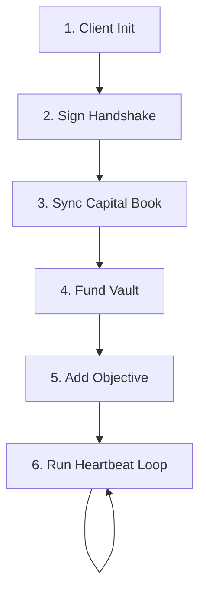

# Production Integration Guide

This guide details how to integrate `@buildaureon/sdk` into server-side agents, automated rebalancing scripts, and frontend user interfaces.

---

## 1. End-to-End Integration Plan

Follow this six-step sequence to configure and start the automated rebalancing loop.



### Step 1: Client Construction
Set up the client, leveraging environment variables for configuration options.

```ts
import { createAureonClient, createSessionTokenProvider } from "@buildaureon/sdk";

const session = createSessionTokenProvider(
  typeof localStorage !== "undefined"
    ? localStorage.getItem("aureon_bearer_token")
    : process.env.AUREON_TOKEN ?? null
);

export const aureon = createAureonClient({
  baseUrl: process.env.AUREON_API_URL || "https://api.aureonlabs.network",
  apiKey: process.env.AUREON_API_KEY ?? null,
  getAccessToken: session.getAccessToken
});
```

### Step 2: EIP-191 Cryptographic Verification
Authenticate session tokens using cryptographic challenge-response verification.

```ts
async function authenticate(walletAddress: string, signerFn: (msg: string) => Promise<string>) {
  // 1. Fetch challenge message
  const { message } = await aureon.getAuthNonce(walletAddress);

  // 2. Sign EIP-191 personal message locally
  const signature = await signerFn(message);

  // 3. Post verification payload
  const { token } = await aureon.verifyWallet({
    address: walletAddress,
    message,
    signature
  });

  session.setToken(token);
  return token;
}
```

### Step 3: Align the Capital Book
Populate local assets into the gateway database.

```ts
const { portfolio, chainId } = await aureon.syncPortfolio();
console.log(`Portfolios aligned for Chain ID ${chainId}. Total Valuation: $${portfolio.totalNotionalUsd}`);
```

### Step 4: Fund the Smart Vault
Automated objectives rebalance tokens held in your Smart Vault on the Robinhood Chain. Allocate capital into the vault before creating rules.

```ts
async function ensureVaultFunded(symbol: string, amount: string, executeTx: (step: any) => Promise<string>) {
  const status = await aureon.getVaultStatus();
  if (status.empty) {
    const prep = await aureon.prepareVaultDeposit({ symbol, amount });
    for (const step of prep.steps) {
      console.log(`Executing step: ${step.label}`);
      const txHash = await executeTx(step);
      console.log(`Step complete. Hash: ${txHash}`);
    }
  }
}
```

### Step 5: Register the Objective
Create the objective. SDK integrations default to `automationMode: "auto"`.

```ts
const objective = await aureon.createObjective({
  name: "Liquid Stable Reserves",
  kind: "stable_allocation",
  targetWeight: 0.30,
  tolerance: 0.03
});
console.log(`Objective ${objective.name} registered. Status: ${objective.status}`);
```

### Step 6: Execute the Watchdog Loop
Poll the gateway regularly to check policy health and execute restorations.

```ts
async function watchdogHeartbeat() {
  try {
    const result = await aureon.refreshWatchdog();
    console.log(`Watchdog completed at ${result.refreshedAt}. System state: ${result.breaches.length} breaches.`);

    for (const breach of result.breaches) {
      const plan = await aureon.getRestorePlan(breach.objectiveId);
      if (plan.kind === "vault_swap") {
        const receipt = await aureon.restoreObjective(breach.objectiveId);
        console.log(`Rebalance executed. Settlement: ${receipt.settlement}, Hash: ${receipt.transactionHash}`);
      }
    }
  } catch (error) {
    console.error("Watchdog heartbeat failed:", error);
  }
}
```

---

## 2. Advanced Scripting Guidelines

### 2.1 Implementing daemon runners
For long-running processes, wrap the heartbeat logic in daemon controllers like PM2 or run them as systemd services.

#### PM2 Configuration (`ecosystem.config.js`)
```js
module.exports = {
  apps: [{
    name: "aureon-agent-loop",
    script: "./dist/index.js",
    instances: 1,
    autorestart: true,
    watch: false,
    env: {
      NODE_ENV: "production",
      AUREON_API_URL: "https://api.aureonlabs.network"
    }
  }]
};
```

#### Systemd Service (`/etc/systemd/system/aureon.service`)
```ini
[Unit]
Description=Aureon Rebalance Watchdog Daemon
After=network.target

[Service]
Type=simple
User=node
WorkingDirectory=/home/node/app
ExecStart=/usr/bin/node dist/index.js
Restart=on-failure
RestartSec=10
Environment=NODE_ENV=production

[Install]
WantedBy=multi-user.target
```

### 2.2 Server-Side Logger Configuration (Pino / Winston)
Log JSON payloads to persistent logging collectors.

```ts
import winston from "winston";
import { createAureonClient } from "@buildaureon/sdk";

const logger = winston.createLogger({
  level: "info",
  format: winston.format.json(),
  transports: [new winston.transports.File({ filename: "aureon-combined.log" })]
});

const aureon = createAureonClient({
  apiKey: process.env.AUREON_API_KEY,
  logger: {
    debug: (msg, ctx) => logger.debug(msg, ctx),
    info: (msg, ctx) => logger.info(msg, ctx),
    warn: (msg, ctx) => logger.warn(msg, ctx),
    error: (msg, ctx) => logger.error(msg, ctx)
  }
});
```

---

## 3. Frontend Deployment (SPA/Vite Environments)

*   **Credential Leakage Prevention**: Never commit `AUREON_API_KEY` to public repositories. Deploy client credentials via backend server API proxy routes.
*   **CORS Configurations**: The production gateway allows request origins matching allowlisted domains configured in the Developer console. For local development, localhost calls are permitted.
*   **Decoupled loop execution**: Frontend interfaces should only allow users to manage objectives and inspect histories. Keep the active rebalancing loops (`refreshWatchdog` and `restoreObjective`) on secure server-side cron loops.
