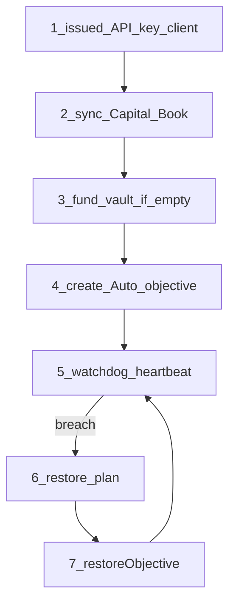

# Production Integration Guide

Integrate `@buildaureon/sdk` into server-side agents and automated rebalancing loops against the live AUREON API.

**Automation note:** SDK integrations support **Automatic mode only** (`automationMode: "auto"` — the default). Do not build Manual Approve agent loops with the SDK; use the operator utility for Manual workflows.

---

## 1. End-to-end agent loop



### Step 1 — Client

```ts
import { createAureonClient } from "@buildaureon/sdk";

export const aureon = createAureonClient({
  baseUrl: process.env.AUREON_API_URL || "https://api.aureonlabs.network",
  apiKey: process.env.AUREON_API_KEY!, // issued Developers key
  timeoutMs: 30_000,
  maxRetries: 2,
  retryDelayMs: 500,
});

const me = await aureon.me();
console.log("operating as", me.walletAddress);
```

Optional Bearer (usually unnecessary with an issued key):

```ts
import { createAureonClient, createSessionTokenProvider } from "@buildaureon/sdk";

const session = createSessionTokenProvider(process.env.AUREON_TOKEN ?? null);
export const aureon = createAureonClient({
  baseUrl: process.env.AUREON_API_URL || "https://api.aureonlabs.network",
  apiKey: process.env.AUREON_API_KEY ?? null,
  getAccessToken: session.getAccessToken,
});
```

### Step 2 — Sync Capital Book

```ts
const { portfolio, chainId } = await aureon.syncPortfolio();
console.log({
  chainId,
  positions: portfolio.positions.length,
  totalNotionalUsd: portfolio.totalNotionalUsd,
});
```

Prefer `syncPortfolio()` over hand-seeded books in production. Use `setPortfolio` only for controlled rehearsals.

### Step 3 — Fund vault when needed

Automatic restores require vault capital. Prepare returns **unsigned** steps — your host signs and broadcasts.

```ts
import type { VaultPrepareResult } from "@buildaureon/sdk";

async function ensureVaultFunded(
  symbol: string,
  amount: string,
  broadcast: (step: VaultPrepareResult["steps"][number]) => Promise<string>
) {
  const status = await aureon.getVaultStatus();
  if (!status.empty && status.canRestore) return status;

  const prep = await aureon.prepareVaultDeposit({ symbol, amount });
  for (const step of prep.steps) {
    const hash = await broadcast(step);
    console.log(step.label, hash);
  }

  return aureon.getVaultStatus();
}
```

Typical broadcast (viem sketch):

```ts
// host-owned — not part of the SDK
await walletClient.sendTransaction({
  to: step.to,
  data: step.data,
  value: step.value ? BigInt(step.value) : 0n,
});
```

### Step 4 — Create an Automatic objective

```ts
const objective = await aureon.createObjective({
  name: "Maintain 20% WETH",
  kind: "balanced_portfolio",
  targetWeight: 0.2,
  tolerance: 0.03,
  targetSymbol: "WETH",
  // automationMode defaults to "auto" — keep it that way for SDK agents
  priority: "medium",
});
```

**Locks:** `targetSymbol` and `automationMode` cannot change after create. Recreate the objective to change token or mode.

### Step 5 — Watchdog heartbeat

```ts
async function heartbeat() {
  const refreshed = await aureon.refreshWatchdog();
  console.log("breaches", refreshed.breaches.length);

  for (const breach of refreshed.breaches) {
    const plan = await aureon.getRestorePlan(breach.objectiveId);
    console.log("plan", plan.kind, plan);

    const receipt = await aureon.restoreObjective(breach.objectiveId);
    console.log({
      settlement: receipt.settlement, // "vault" | "staged"
      status: receipt.status,
      tx: receipt.transactionHash,
    });
  }

  const health = await aureon.getHealth();
  return health;
}
```

### Step 6 — Verify

```ts
await aureon.getHealth(objective.id);
await aureon.getTimeline(objective.id);
await aureon.listExecutions(objective.id);
```

Always branch UI/agent copy on `receipt.settlement`.

---

## 2. Recommended objective kinds for agents

| Kind | Typical use |
| --- | --- |
| `balanced_portfolio` | Hold `targetSymbol` near a weight band |
| `stable_allocation` | Keep a stable sleeve near a weight |
| `risk_ceiling` | Cap portfolio risk score |
| `reward_reinvestment` | Sweep rewards into a sleeve |

Start with one Automatic `balanced_portfolio` objective and a funded vault before adding more policies.

---

## 3. Daemon runners

### PM2

```js
module.exports = {
  apps: [
    {
      name: "aureon-agent-loop",
      script: "./dist/index.js",
      instances: 1,
      autorestart: true,
      env: {
        NODE_ENV: "production",
        AUREON_API_URL: "https://api.aureonlabs.network",
        // AUREON_API_KEY from secret store / PM2 ecosystem secrets
      },
    },
  ],
};
```

### systemd

```ini
[Unit]
Description=AUREON Automatic restore agent
After=network.target

[Service]
Type=simple
User=node
WorkingDirectory=/home/node/app
ExecStart=/usr/bin/node dist/index.js
Restart=on-failure
RestartSec=10
Environment=NODE_ENV=production

[Install]
WantedBy=multi-user.target
```

### Logging

```ts
import { createAureonClient } from "@buildaureon/sdk";

const aureon = createAureonClient({
  apiKey: process.env.AUREON_API_KEY!,
  logger: {
    debug: (msg, ctx) => console.debug(msg, ctx),
    info: (msg, ctx) => console.info(msg, ctx),
    warn: (msg, ctx) => console.warn(msg, ctx),
    error: (msg, ctx) => console.error(msg, ctx),
  },
});
```

Never log API keys, Bearer tokens, or private keys.

---

## 4. Frontend / SPA notes

- Do not ship issued API keys in public browser bundles.
- Prefer a backend proxy for agent credentials.
- Keep `refreshWatchdog` / `restoreObjective` loops on the server.
- Browser operator UX is the utility app (wallet session), not the SDK agent path.

---

## 5. Troubleshooting

| Symptom | Likely cause | Fix |
| --- | --- | --- |
| 401 invalid key | Wrong / paused / revoked key | Rotate in Developers |
| 401 need issued key | Env bootstrap key alone | Use an issued Developers key |
| Vault empty / cannot restore | No vault capital | `prepareVaultDeposit` → broadcast → sync |
| Update rejects symbol/mode | Locked at create | Recreate objective |
| Restore receipt `staged` | Ledger-local path | Do not claim on-chain |
| Health still violated after restore | Prices / sizing / liquidity | Re-read plan, vault balances, timeline |
| Network / timeout | RPC or API latency | Raise `timeoutMs`, set `maxRetries` |

---

## 6. Related docs

- [Auth](./auth.md)
- [Architecture](./architecture.md)
- [Client API](./client-api.md)
- [Error model](./error-model.md)
- [Security](./security.md)
