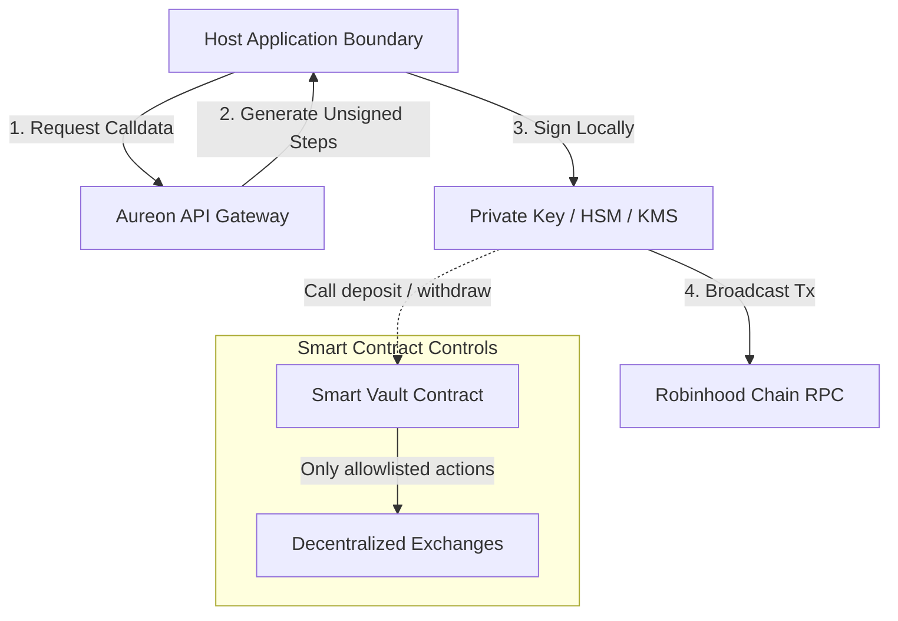

# Security Model and Practices

This document outlines the security architecture of `@aureon/sdk`, its integration with Smart Vault smart contracts, and practices for secure production environments.

---

## 1. Gateway Trust Boundaries

AUREON operates on a non-custodial gateway model. The API acts as an analytical policy engine, price indexer, and coordinator, but does not control asset custody.

### 1.1 Private Key Isolation
The SDK provides no features for loading or storing private keys or mnemonics. The host application handles transaction signing locally using EIP-191 signatures or raw transaction serializers. Because private keys are never transmitted to the AUREON API, a gateway breach cannot compromise user keys.

### 1.2 Unsigned Calldata Generation
Endpoints like `prepareVaultDeposit` and `prepareVaultWithdraw` return structured calldata. You can decode and verify this data against open-source contract ABIs before signing and broadcasting.

---

## 2. Smart Contract Access Control

The AUREON Smart Vault contracts on the Robinhood Chain enforce strict permission boundaries:

*   **Owner Gate**: Only the address that deployed the vault (or was assigned ownership) can execute direct withdrawals.
*   **Allowlisted Keepers**: Swap routes can only be executed by registered keeper addresses. The keeper cannot withdraw tokens to external third-party addresses; they are restricted to swapping allowlisted assets within the vault.
*   **Limits and Slippage**: The contracts enforce maximum slippage tolerances on swaps to prevent sandwich attacks and price manipulation.

---

## 3. Credentials and API Keys Management

*   **Zero Commits**: Never check API keys into git repositories. Load keys from environment variables or secure stores (e.g. AWS Secrets Manager, HashiCorp Vault).
*   **CI/CD Configuration**: If you run tests in automated pipelines (e.g., GitHub Actions, GitLab CI), store credentials as encrypted secrets.
*   **Frontend Mitigation**: Frontends should query an intermediate backend service instead of exposing API keys directly to the client bundle.
*   **Key Rotation**: Generate replacement credentials and deprecate compromised tokens in the developer console immediately if a breach is suspected.

---

## 4. Understanding Staged Settlement

AUREON receipts contain a `settlement` field:

*   **Vault Settlement (`vault`)**: Transactions are settled on-chain on the Robinhood Chain. These have a real transaction hash and are verifiable via explorer.
*   **Staged Settlement (`staged`)**: Simulated rebalances that update gateway database states without broadcasting transactions. This is used during rehearsals and testing.

> [!WARNING]
> Do not display staged rebalances as completed on-chain transactions in your dashboards. Always check the `settlement` attribute before presenting transaction confirmations to operators.

---

## 5. Production Checklist

Review this security checklist before deploying your rebalancing daemon to production:

- [ ] **Private Key Isolation**: Confirm that private keys are stored in environment variables or KMS, and are never logged or exposed.
- [ ] **EIP-191 Handshake**: Ensure all user logins use the cryptographic challenge-response flow (`verifyWallet`).
- [ ] **Scope Checks**: Verify that the API Key has the minimum permissions needed to run the target agent.
- [ ] **Gas Auditing**: Maintain a gas reserve on the signing wallet to cover deposit and withdrawal transactions on the Robinhood Chain.
- [ ] **Staged Handling**: Confirm your user interface clearly distinguishes between staged and vault settlements.
- [ ] **Slippage Bounds**: Configure appropriate slippage tolerances on objectives to prevent execution failure during market volatility.
