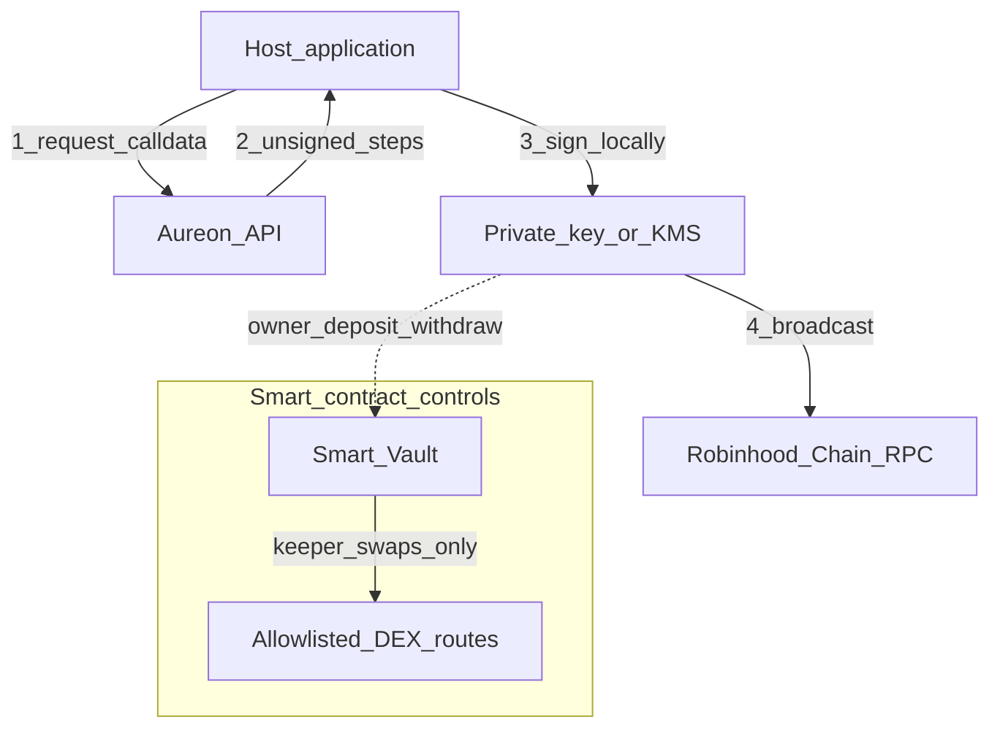

# Security Model and Practices

Security architecture for `@buildaureon/sdk`: trust boundaries, credentials, vault signing, and production checklist.

**Automation note:** SDK agents should run **Automatic** objectives only. Manual Approve flows are utility concerns, not SDK security surface.

---

## 1. Gateway trust boundaries

AUREON is non-custodial. The API is a policy engine, price indexer, and coordinator. It does not hold private keys and does not broadcast owner withdrawals for you.

### 1.1 Private key isolation

The SDK never loads, stores, or transmits private keys or mnemonics. Signing stays in the host (viem, ethers, HSM, KMS). A gateway breach cannot drain vaults by itself.

### 1.2 Issued API keys are wallet credentials

An **issued** developer key identifies the bound wallet for control-plane operations (sync, objectives, health, restore, prepare). Treat it like a password:

- Create in utility **Developers**
- Store in env / secret manager
- Pause or revoke on leak
- Prefer one key per agent host

Env bootstrap keys on the server unlock product access only. They do **not** identify a wallet and must not be used as agent identity.

### 1.3 Unsigned calldata

`prepareVaultDeposit` / `prepareVaultWithdraw` return structured steps. Decode against published ABIs before signing. Broadcast is always host-side.

---

## 2. What a compromised API key can and cannot do

| Can | Cannot |
| --- | --- |
| Read portfolio, vault, health, timeline | Sign owner deposit/withdraw txs |
| Create / update / pause Auto objectives | Withdraw vault funds to arbitrary addresses |
| Request restore plans and trigger Automatic restore coordination | Bypass vault keeper allowlists |
| Create additional developer keys under the same wallet | Recover a private key |

Keeper-driven Automatic restores execute allowlisted vault swaps. Keepers cannot send vault assets to arbitrary third parties.

---

## 3. Smart vault access control

- **Owner path:** deposits and withdrawals require owner-signed txs from prepare steps.
- **Keeper path:** Automatic restores use registered keepers on allowlisted routes only.
- **Slippage / limits:** vault and planner enforce execution bounds to reduce bad fills.

---

## 4. Settlement honesty

Every execution receipt includes `settlement`:

| Value | Meaning | UI rule |
| --- | --- | --- |
| `vault` | On-chain vault / keeper settlement with verifiable hash | May show as on-chain |
| `staged` | Ledger-local / rehearsal — not a chain settlement | Must **not** be labeled as on-chain |

Never collapse staged into “confirmed on Robinhood Chain.”

---

## 5. Transport and logging hygiene

- Prefer HTTPS production base URL `https://api.aureonlabs.network`.
- Do not log raw `Authorization` or `X-Aureon-Api-Key`.
- Redact prepare step calldata in public logs if it includes sensitive amounts in your threat model.
- Set `timeoutMs` / `maxRetries` deliberately for agent loops (see [transport.md](./transport.md)).

---

## 6. Frontend vs agent hosts

| Host | Guidance |
| --- | --- |
| Server agent / cron | Issued API key in secret store; private key in KMS if broadcasting deposits |
| Browser SPA | Do **not** embed issued API keys in public bundles; proxy through your backend |
| Operator utility | Wallet Bearer only — separate from SDK agent auth |

---

## 7. Production checklist

- [ ] Issued developer key (not a shared env bootstrap key) in secrets
- [ ] Private keys isolated from the API key and never logged
- [ ] Deposit/withdraw broadcast path reviewed and ABI-checked
- [ ] Automatic objectives only in SDK loops
- [ ] UI / agent summaries honor `settlement: vault | staged`
- [ ] Gas reserve on the signing wallet for owner txs
- [ ] Key rotation plan (pause/revoke in Developers)
- [ ] Error handling branches on `error.code` (see [error-model.md](./error-model.md))

---

## 8. Related docs

- [Auth](./auth.md)
- [Architecture](./architecture.md)
- [Integration guide](./integration-guide.md)
- [Error model](./error-model.md)
