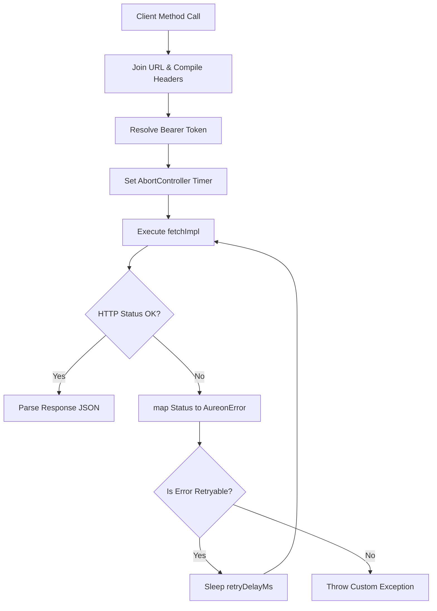

# Transport Layer Reference

This document describes the transport layer of `@aureon/sdk`, implemented in `src/transport/http.ts`.

---

## 1. Network Request Lifecycle

Every SDK client call delegates network execution to the `requestJson` helper.



1.  **URL Join and Query Compilation**: The transport engine normalizes the base URL and path string, then serializes any query parameters.
2.  **Bearer Token Resolution**: The `getAccessToken` async function evaluates the current session token to attach the `Authorization` header.
3.  **Timeout Guard Configuration**: An `AbortController` handles request timeouts, defaulting to 30 seconds.
4.  **Execution and Error Mapping**: The client fires the request. If the gateway returns an error, it is converted to a typed `AureonError` subclass.
5.  **Bounded Retry**: The client retries the request if it encountered a transient failure (e.g. rate limit, gateway timeout) and retry budget is remaining.

---

## 2. Standard Header Layout

Every HTTP request sent by the SDK contains these default headers:

| Header | Required | Typical Value | Purpose |
|--------|----------|---------------|---------|
| `Accept` | Yes | `application/json` | Specifies the accepted media type. |
| `Content-Type` | Optional | `application/json` | Specifies the payload format (attached if a request body is present). |
| `X-Aureon-SDK` | Yes | `@aureon/sdk/0.1.0` | Identifies client package version. |
| `X-Aureon-Api-Key` | Optional | `api_key_abc123` | Sent if the client is configured with an API key. |
| `Authorization` | Optional | `Bearer token_xyz` | Session JWT, attached if a token provider is active. |

---

## 3. URL Utility Implementations

### 3.1 `joinUrl`
Normalizes base URLs and paths to prevent double slashes at joining boundaries:
```ts
function joinUrl(base: string, path: string): string {
  const cleanBase = base.endsWith("/") ? base.slice(0, -1) : base;
  const cleanPath = path.startsWith("/") ? path.slice(1) : path;
  return `${cleanBase}/${cleanPath}`;
}
```

### 3.2 `withQuery`
Serializes query parameter dictionaries into standard URL format:
```ts
function withQuery(path: string, query?: Record<string, any>): string {
  if (!query) return path;
  const parts = Object.entries(query)
    .filter(([_, v]) => v !== undefined && v !== null)
    .map(([k, v]) => `${encodeURIComponent(k)}=${encodeURIComponent(String(v))}`);
  if (parts.length === 0) return path;
  const separator = path.includes("?") ? "&" : "?";
  return `${path}${separator}${parts.join("&")}`;
}
```

---

## 4. Timeout Budgets and Request Aborts

The transport engine protects applications from hanging sockets using the Fetch API's `AbortController` signal.

```ts
const controller = new AbortController();
const timeoutId = setTimeout(() => controller.abort(), options.timeoutMs);

try {
  const response = await options.fetchImpl(url, {
    ...init,
    signal: controller.signal
  });
  return response;
} catch (error) {
  if (error instanceof Error && error.name === "AbortError") {
    throw new AureonTimeoutError("Request timed out", options.timeoutMs);
  }
  throw new AureonNetworkError(error instanceof Error ? error.message : String(error));
} finally {
  clearTimeout(timeoutId);
}
```

*   **Configuring Timeout**: Pass `timeoutMs` (in milliseconds) when instantiating `createAureonClient`.
*   **Custom Abort Signals**: You can pass a custom `AbortSignal` in `RequestOptions` to cancel requests manually based on user actions.

---

## 5. Retry Loop and Backoff Configurations

The SDK implements a retry mechanism for transient exceptions:

*   **Retryable Failures**: `NETWORK_ERROR`, `TIMEOUT`, `RATE_LIMITED` (HTTP 429), and `SERVER_ERROR` (HTTP 5xx).
*   **Default Behavior**: `maxRetries` is 0. If you configure `maxRetries: 2` and `retryDelayMs: 500`, the client will try the request up to 3 times, waiting 500ms between attempts.

---

## 6. Built-in Logger Adapters

Integrate with internal request diagnostics using the `AureonLogger` interface:

```ts
export interface AureonLogger {
  debug(message: string, context?: Record<string, unknown>): void;
  info(message: string, context?: Record<string, unknown>): void;
  warn(message: string, context?: Record<string, unknown>): void;
  error(message: string, context?: Record<string, unknown>): void;
}
```

*   `createConsoleLogger(prefix)`: Logs requests, attempts, and errors to the developer console.
*   `silentLogger`: Suppresses logs.
