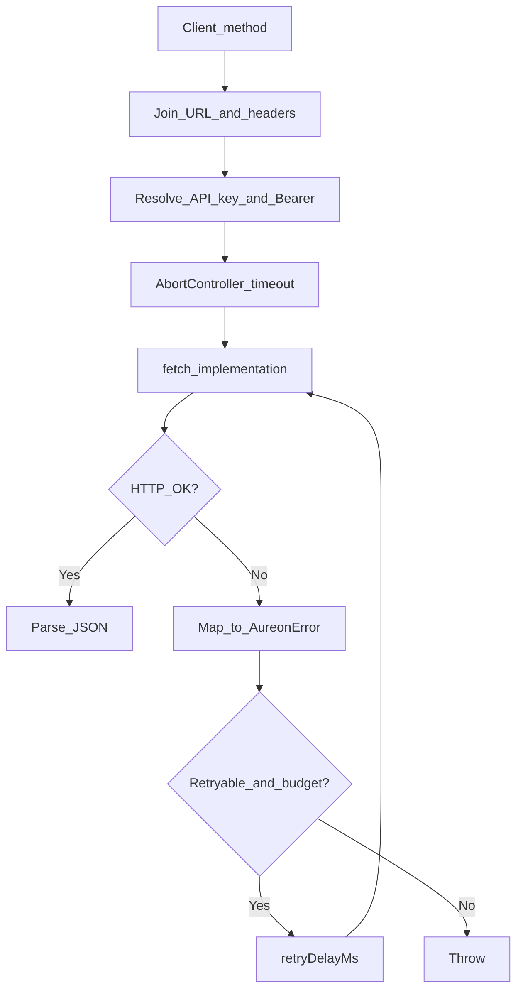

# Transport Layer Reference

HTTP transport for `@buildaureon/sdk` (`src/transport/http.ts`): headers, timeouts, retries, URL helpers, and logging.

---

## 1. Request lifecycle



1. Join `baseUrl` + path; attach query string when needed.
2. Resolve `X-Aureon-Api-Key` from `apiKey` / `getApiKey`.
3. Resolve `Authorization: Bearer …` from `getAccessToken` / `authToken` (optional).
4. Apply timeout via `AbortController` (default 30s).
5. On failure, map status → typed error; retry only if configured and retryable.

---

## 2. Headers

| Header | When | Purpose |
| --- | --- | --- |
| `Accept` | Always | `application/json` |
| `Content-Type` | Body present | `application/json` |
| `X-Aureon-SDK` | Always | Package identity / version |
| `X-Aureon-Api-Key` | Key configured | Product access + issued-key identity |
| `Authorization` | Token configured | Optional Bearer session |
| Custom `headers` | If set on client | Merged into every request |

Issued developer keys in `X-Aureon-Api-Key` are enough for control-plane identity on the live API. Bearer is optional and wins when both are present.

---

## 3. Client transport options

```ts
createAureonClient({
  baseUrl: "https://api.aureonlabs.network",
  apiKey: process.env.AUREON_API_KEY!,
  timeoutMs: 30_000,   // per attempt
  maxRetries: 2,        // extra attempts after first failure
  retryDelayMs: 500,    // fixed delay between attempts
  fetch: customFetch,   // optional
  headers: { "X-Debug": "1" },
  logger: myLogger,
});
```

| Option | Default | Notes |
| --- | --- | --- |
| `timeoutMs` | `30000` | Must be positive finite |
| `maxRetries` | `0` | Extra tries after the first failure |
| `retryDelayMs` | `250` | Fixed sleep between tries |
| `fetch` | `globalThis.fetch` | Inject for tests / unusual runtimes |

---

## 4. Retry policy

**Retryable:** network failures, timeouts, HTTP 429, HTTP 5xx (when mapped as retryable).

**Not retryable:** 400 validation, 401/403 auth, 404, most 409 conflicts (operator must change state).

Total attempts = `1 + maxRetries`.

---

## 5. URL helpers

### `joinUrl`

Prevents double slashes when combining base + path.

### `withQuery`

Serializes defined query params with `encodeURIComponent`. Omits `null` / `undefined`.

---

## 6. Timeouts and aborts

```ts
const controller = new AbortController();
const timeoutId = setTimeout(() => controller.abort(), timeoutMs);
try {
  return await fetchImpl(url, { ...init, signal: controller.signal });
} catch (error) {
  if (error instanceof Error && error.name === "AbortError") {
    throw /* AureonTimeoutError */;
  }
  throw /* AureonNetworkError */;
} finally {
  clearTimeout(timeoutId);
}
```

For agent loops that call restore + sync, prefer slightly higher `timeoutMs` under load rather than disabling timeouts.

---

## 7. Logger interface

```ts
interface AureonLogger {
  debug(message: string, context?: Record<string, unknown>): void;
  info(message: string, context?: Record<string, unknown>): void;
  warn(message: string, context?: Record<string, unknown>): void;
  error(message: string, context?: Record<string, unknown>): void;
}
```

Helpers may include console / silent adapters depending on package exports. Never log secrets from context.

---

## 8. Testing transport

- Inject a fake `fetch` that returns controlled status/body.
- Assert header presence of `X-Aureon-Api-Key` for SDK clients.
- Assert retries by counting fetch invocations with `maxRetries > 0` and 503 responses.

---

## 9. Related docs

- [Error model](./error-model.md)
- [Auth](./auth.md)
- [Client API](./client-api.md)
- [Security](./security.md)
